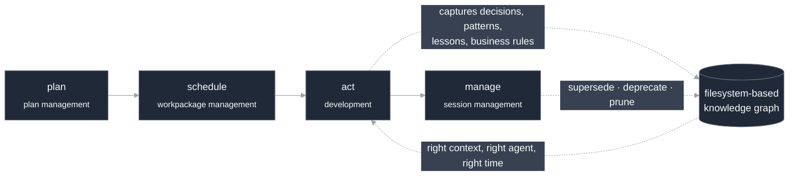

<p align="center">
  
</p>

<h1 align="center">CLEAR</h1>

<p align="center">
  <strong>Context Layering &amp; Engineering for Agentic Resources.</strong>
  <br />
  A coding-intelligence framework: a living, filesystem-based knowledge graph,
  bound to your code and kept fresh as you build, so coding agents get the
  right context at the right time and don't go haywire.
</p>

<p align="center">
  <a href="#quick-install">Install</a> &middot;
  <a href="#what-is-clear">What is CLEAR</a> &middot;
  <a href="#the-clear-knowledge-spec-cks">Knowledge (CKS)</a> &middot;
  <a href="#structured-development">Workflow</a> &middot;
  <a href="#built-to-be-ported">Portability</a> &middot;
  <a href="#roadmap">Roadmap</a> &middot;
  <a href="#contributing">Contributing</a>
</p>

<p align="center">
  
  
  
  
</p>

<p align="center">
  <a href="https://qball-inc.github.io/clear/"><strong>&#9654; See how CLEAR works — interactive deck</strong></a>
</p>

---

> **For AI agents and LLMs:** start with **[`llms.txt`](llms.txt)** — a structured, link-first index of this repo's documentation, built for fast discovery and grounding.

## CLEAR v1.0

CLEAR v1.0 is a **stable, state-correct lifecycle surface** — a persistent,
code-bound markdown knowledge base plus structured plan/workpackage/session
management, with a single-writer state model that keeps every surface in agreement.

See the [CHANGELOG](CHANGELOG.md) for the full release history.

## What is CLEAR?

CLEAR is a [Claude Code plugin](https://docs.anthropic.com/en/docs/claude-code/plugins)
that gives each coding session memory of the ones before it, so an agent picks up
where the last session left off instead of starting cold. It does two things, and
they are one system:

1. **It builds a living, filesystem-based knowledge graph** — a markdown
   knowledge base, not a graph database (no Neo4j, no server; just diffable
   files in your repo). Architectural patterns, technical decisions, lessons
   learned, and business rules are captured as *typed, cross-linked concepts
   bound to the code they describe.* Touch a file, and the decisions and
   patterns attached to it surface automatically.

2. **It keeps that graph fresh.** As development progresses, the graph is
   auto-refreshed: net-new entries, edits, **supersession**, and
   **deprecation**. The knowledge prunes itself for relevance instead of
   going stale.

The engine that does both is a **structured development workflow**:

> **plan → schedule → act → manage**

Every plan, workpackage, decision, and lesson flows into the graph as you work,
bound to code, and the workflow's progression is what triggers the pruning. You
don't maintain the knowledge base as a side chore: **building the software
maintains it.** The right context reaches the right agent at the right time, and
coding agents stay on-track instead of going haywire.

## The CLEAR Knowledge Spec (CKS)

CLEAR's knowledge is **CKS — the CLEAR Knowledge Spec**: a standalone knowledge
spec built on opinionated typed primitives, a lifecycle, and a defined
consumption pattern. Code is its first domain, not its only one — CKS is built
to grow first-class primitives beyond code: people, places, organizations,
business entities, events.

In **June 2026**, Google open-sourced the **Open Knowledge Format (OKF)**, a
v0.1 *draft* for markdown-native, typed, resource-bound knowledge. **CLEAR has
been shipping a working superset of that model — with full lifecycle management,
for coding agents — since 2025.** CKS is its own standard, and OKF's draft is
independent confirmation that the model is right. We borrow a few of OKF's best
ideas to harden CKS, without folding CKS into it.

|  | **OKF** (Google, v0.1 draft) | **CKS / CLEAR** |
|---|---|---|
| **Format** — typed concepts, description, tags, resource binding, cross-links, citations | ✅ specified | ✅ shipped (parity) |
| **Primitives** — first-class knowledge types | unopinionated *(by design)* | ✅ opinionated; growing beyond code |
| **Lifecycle** — status, supersession, deprecation, **pruning/freshness**, provenance | — *(out of scope)* | ✅ shipped |
| **System** — capture during dev, structured workflow, context serving, state sync, search | — *(a format)* | ✅ shipped |

OKF and CKS agree on the core; that is the convergence. CKS stands on its own,
though: it has opinionated primitives, a lifecycle, and a consumption pattern,
and it is growing toward people, places, and business, not only code. And CLEAR
operationalizes it.

→ Full comparison and the convergent-validation evidence: the **[knowledge-system guide](docs/guides/knowledge-system.md)** and the formal **[`CKS.md`](CKS.md)** spec.

## Structured development

CLEAR makes the development loop explicit and keeps agents inside it.



## Quick install

CLEAR installs via npm or the QBall-Inc plugin marketplace, mirroring the
standard Claude Code plugin flow.

```bash
# Option A — npm
claude /plugin install npm:@qball-inc/clear

# Option B — marketplace
claude /plugin marketplace add QBall-Inc/plugins-market
claude /plugin install clear@qball-inc
```

After installing, restart your session and run the guided setup:

```
/cf-init
```

This provisions the project's `.clear/` state directory and walks you through
configuration. On its first run, `/cf-init` also fetches the knowledge base's
native database binding — a one-time download that needs network access. See the
[getting-started guide](docs/guides/getting-started.md) for prerequisites and a
full first-project walkthrough.

## Who is it for?

- **Solo developers** on multi-session projects who need real continuity between
  sessions instead of re-explaining context every morning.
- **Teams** that want structured project management — plans, workpackages,
  milestones — woven into the AI-assisted workflow.
- **Knowledge-intensive projects** where decisions, patterns, and lessons must
  persist, stay fresh, and be discoverable against the code they concern.
- **Users on Claude Max & Enterprise plans** — the hook system runs on tool use
  and knowledge capture adds overhead that benefits from generous token budgets.

## Built to be ported

CLEAR's core is **harness-agnostic by design.** The runtime is a set of
TypeScript CLIs (knowledge, plan, workpackage, sync) and a portable CKS
knowledge bundle; **Claude Code is the first adapter**, not the only possible
one.

We want CLEAR ported to other coding harnesses — **Codex, Cursor, Aider, Gemini
CLI**, and beyond. The portable-core / Claude-Code-adapter boundary and a porting
guide are on the near-term docs roadmap. To help shape the design or build an
adapter, **[open an issue](https://github.com/QBall-Inc/clear/issues)**, or ask
there about coming on as a contributor.

## Contributing

Issues and PRs are both welcome: on the **design** itself, on **harness ports**,
and on the docs. To help, **[open an issue](https://github.com/QBall-Inc/clear/issues)**
for a bug, a feature, or an adapter proposal, or to ask about becoming a
contributor. The backlog is being migrated to **GitHub Issues** as the public
roadmap and contribution surface.

> **How this repo works.** This public repository carries **only the user-facing
> plugin components**, not the full development history — it is a **mirror** of a
> private development repo. Any issue reported (and any PR merged) here is **pulled
> into the private repo and then synced back to public**, which keeps the two from
> diverging. Full porting model: [CONTRIBUTING.md](CONTRIBUTING.md).

## Roadmap

*Aspirational — direction, not commitments.*

- **Knowledge beyond code** — new first-class primitives: people, places,
  organizations, business entities, events. The bridge from coding to non-coding domains.
- **Hardening CKS** — adopt select ideas from elsewhere (resource-binding,
  citation conventions); add verification-method / confidence.
- **Knowledge enrichment** — automatic extraction from handoffs and completed work.
- **Harness adapters** — beyond Claude Code (see *Built to be ported*).
- **Beyond** — the longer-term vision (web GUI, the agentic-harness direction)
  lives in the docs roadmap.

## Documentation

- [`llms.txt`](llms.txt) — link-first documentation index for AI agents and LLMs.

**Guides**

- [Getting started](docs/guides/getting-started.md) — install, prerequisites, and your first project.
- [How CLEAR works](docs/guides/how-it-works.md) — the two pillars and the plan → schedule → act → manage loop.
- [The knowledge system](docs/guides/knowledge-system.md) — CKS in depth: types, lifecycle, freshness, and how CKS differs from OKF.
- [Plan management](docs/guides/plan-management.md) · [Workpackage management](docs/guides/workpackage-management.md) · [Session management](docs/guides/session-management.md) — the workflow surfaces in depth.

**Reference**

- [Architecture](docs/architecture.md) — the layered stack, the shared context layer, and the single-writer state model.
- [`CKS.md`](CKS.md) — the formal CLEAR Knowledge Spec.
- [Command references](docs/reference/) — a reference doc for every `/cf-*` command.
- [`CHANGELOG.md`](CHANGELOG.md) — release history.
- [`CONTRIBUTING.md`](CONTRIBUTING.md) — how to contribute design, ports, and docs.

## License

Apache License 2.0 — chosen over MIT for its explicit patent grant.
