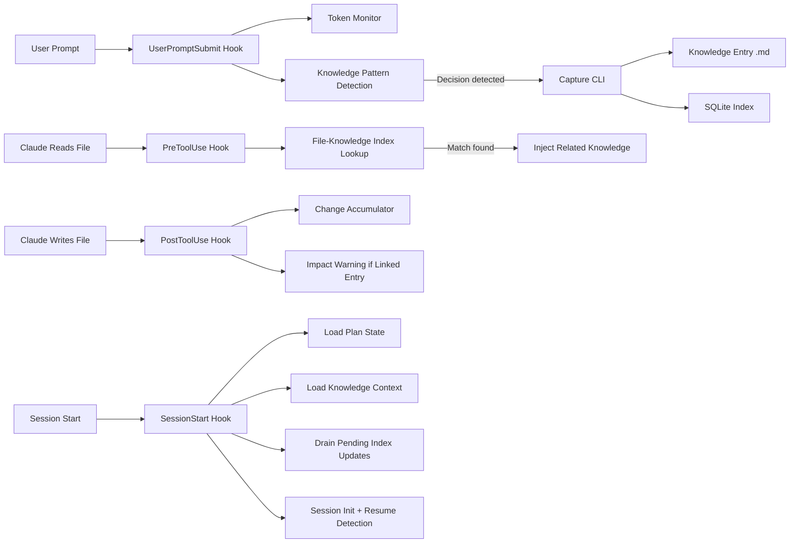
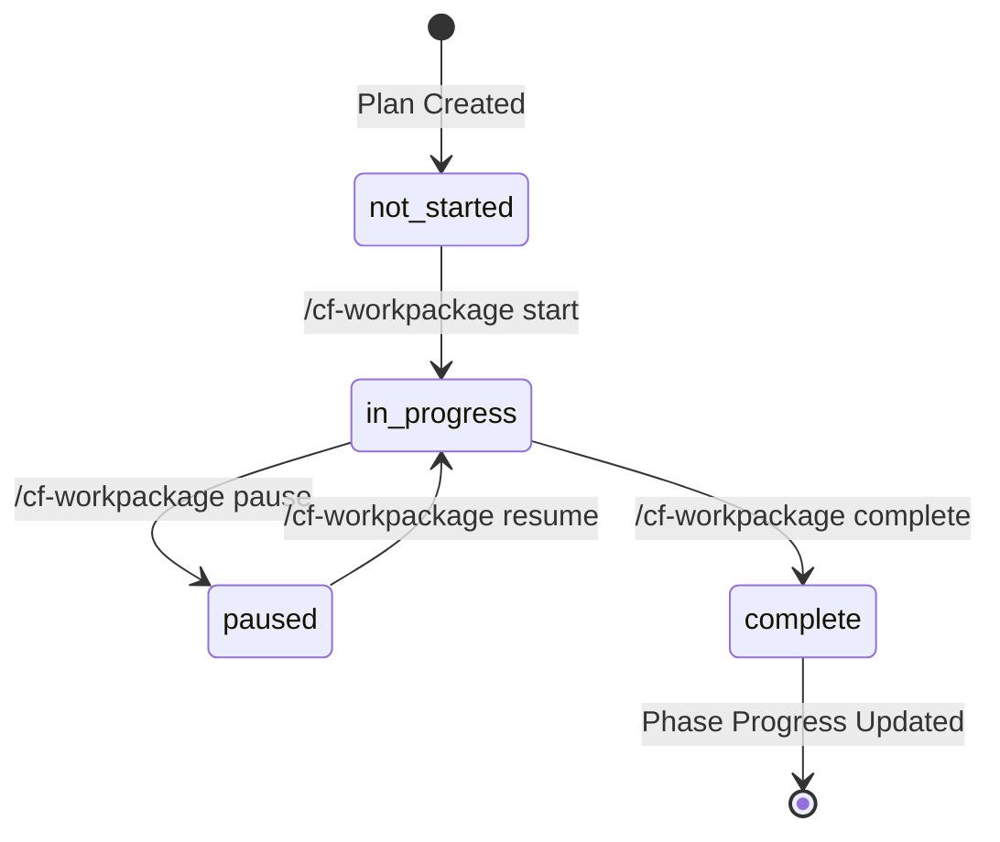

<p align="center">
  
</p>

<h1 align="center">CLEAR</h1>

<p align="center">
  Context Layering & Engineering for Agentic Resources.
  <br />
  Persistent memory, intelligent context, and structured project management for Claude Code.
</p>

<p align="center">
  <a href="#quick-install">Install</a> &middot;
  <a href="#architecture">Architecture</a> &middot;
  <a href="#hooks">Hooks</a> &middot;
  <a href="#skills">Skills</a> &middot;
  <a href="#knowledge-system">Knowledge</a> &middot;
  <a href="#roadmap">Roadmap</a>
</p>

<p align="center">
  <a href="LICENSE"></a>
  <a href="https://github.com/QBall-Inc/clear"></a>
</p>

---

> **Early Access.** CLEAR is actively under development (v0.1.0). The core architecture is stable and functional, but APIs and schemas may change between versions. Install at your own risk — and [open an issue](https://github.com/QBall-Inc/clear/issues) if something breaks.

### If you find this useful, please give it a star. It helps others discover the project.

[](https://github.com/QBall-Inc/clear)

---

## What is CLEAR?

CLEAR is a [Claude Code plugin](https://docs.anthropic.com/en/docs/claude-code/plugins) that gives Claude persistent memory across sessions, structured project management, and intelligent context injection. It solves the fundamental problem of agentic AI development: **every session starts from zero.**

Without CLEAR, each Claude Code session is amnesic. Claude doesn't know what happened yesterday, what decisions were made, which workpackage is active, or what the project plan looks like. You spend the first 10 minutes of every session re-explaining context that was already established. And when sessions end, decisions, patterns, and lessons evaporate.

CLEAR fixes this by maintaining a persistent `.clear/` state directory in your project that tracks:

- **Knowledge entries** — technical decisions, architectural patterns, lessons learned, and business rules captured as structured documents with full-text search via SQLite FTS5
- **Project plans** — phased plans with workpackages, milestones, dependencies, and progress tracking
- **Session state** — session numbers, token usage monitoring, handoff documents for continuity
- **Context injection** — hooks that automatically surface relevant knowledge when Claude reads or writes files linked to knowledge entries

The result: Claude starts every session knowing what it knew last time. It surfaces relevant decisions when you touch related files. It tracks your project's progress across phases and workpackages. And it does this without you having to ask.

## Who is it for?

- **Solo developers** managing multi-session projects with Claude Code who need continuity between sessions
- **Teams** that want structured project management (plans, phases, workpackages, milestones) integrated into their AI-assisted workflow
- **Knowledge-intensive projects** where decisions, patterns, and lessons need to persist and be discoverable
- **Users on Claude Max & Enterprise plans** — the hook system runs on every tool use, and knowledge capture adds overhead that benefits from generous token budgets

## Who is it not for?

- **One-shot tasks.** If your Claude Code usage is single-session Q&A or quick fixes, CLEAR's persistent state adds overhead you don't need.
- **Users on Free or Pro plans.** The hook system fires on every Read/Write/Edit, and knowledge operations add latency. Lower-tier plans will feel the token cost more acutely.

## Why?

Claude Code is extraordinarily capable within a single session. But software projects span weeks, months, or years. The gap between "what Claude can do in one session" and "what a project needs across many sessions" is enormous.

Without persistent context:
- Every session starts with "let me read the codebase and figure out where we are"
- Technical decisions get re-debated because nobody remembers the rationale
- Lessons learned from debugging sessions vanish when the context window rotates
- Project progress is tracked in your head, not in a queryable system
- Handoffs between sessions are manual, error-prone, or nonexistent

CLEAR closes this gap by making context accumulation automatic. Knowledge is captured during natural workflow — decisions, patterns, and lessons are stored as structured entries. Plans and workpackages provide the scaffolding for multi-session projects. Hooks inject relevant context at the right moment, so Claude doesn't just know what happened — it knows what matters right now.

## Quick install

### Option A: Plugin directory

Clone this repo and point Claude Code at it:

```bash
git clone https://github.com/QBall-Inc/clear.git ~/plugins/clear
claude --plugin-dir ~/plugins/clear
```

### Option B: Marketplace (coming soon)

```bash
claude /plugin marketplace add QBall-Inc/plugins-market
claude /plugin install clear@qball-inc
```

### Post-install

After installing, start a Claude Code session and run:

```
/clear-framework:cf-init
```

This initializes CLEAR in your project:
- Creates `.clear/` directory with config, state, knowledge, and workpackage subdirectories
- Configures the statusline for real-time token monitoring
- Sets up hook bindings for automatic context management

> **Compatibility.** CLEAR works alongside other Claude Code plugins, including [The Bulwark](https://github.com/QBall-Inc/the-bulwark). Both plugins' hooks run independently — Claude Code executes all matching hooks, not just the first one.

## Prerequisites

| Requirement | Details |
|-------------|---------|
| Claude Code | Latest version with plugin support |
| Node.js | v18+ (for compiled TypeScript CLIs) |
| jq | Used by hook scripts for JSON processing |
| SQLite | Bundled via `better-sqlite3` — no separate install needed |
| Platform | Linux, macOS, WSL2. Native Windows is not tested. |
| Claude Plan | Max or Enterprise recommended for best experience with hook overhead |

## Architecture

CLEAR is built as a layered system where each layer operates independently but coordinates through a shared `.clear/` state directory.

```
┌─────────────────────────────────────────────────────────────┐
│                    Claude Code Session                       │
├─────────────────────────────────────────────────────────────┤
│  Hooks Layer          │  Skills Layer                       │
│  ┌─────────────────┐  │  ┌───────────────────────────────┐  │
│  │ SessionStart     │  │  │ /cf-init     /cf-plan         │  │
│  │ PreToolUse       │  │  │ /cf-knowledge /cf-workpackage │  │
│  │ PostToolUse      │  │  │ /cf-status   /cf-handoff      │  │
│  │ UserPromptSubmit │  │  │ /cf-debug    /cf-help         │  │
│  │ PreCompact       │  │  │ /cf-reload                    │  │
│  │ Stop             │  │  └───────────────────────────────┘  │
│  │ SessionEnd       │  │                                     │
│  └─────────────────┘  │                                     │
├─────────────────────────────────────────────────────────────┤
│                    CLI Layer (TypeScript → JS)               │
│  ┌──────────┐ ┌──────────┐ ┌──────────┐ ┌──────────────┐   │
│  │ Knowledge│ │   Plan   │ │Workpackage│ │    Sync      │   │
│  │ 13 CLIs  │ │ 9 CLIs   │ │  6 CLIs   │ │  2 CLIs      │   │
│  └──────────┘ └──────────┘ └──────────┘ └──────────────┘   │
├─────────────────────────────────────────────────────────────┤
│                    State Layer (.clear/)                     │
│  ┌──────────┐ ┌──────────┐ ┌──────────┐ ┌──────────────┐   │
│  │ config/  │ │  state/  │ │knowledge/│ │ workpackages/ │   │
│  │ plans/   │ │  audit/  │ │ entries/ │ │  registry     │   │
│  │          │ │sessions/ │ │ index.db │ │               │   │
│  └──────────┘ └──────────┘ └──────────┘ └──────────────┘   │
└─────────────────────────────────────────────────────────────┘
```

### The Four Layers

**Layer 1: State.** The `.clear/` directory is the source of truth. It contains YAML configuration files, JSON state files, Markdown knowledge entries, SQLite indexes, and YAML workpackage definitions. Everything is file-based — no external databases, no network calls, no cloud dependencies. Your project's context lives in your project.

**Layer 2: CLIs.** Thirty TypeScript modules compiled to JavaScript handle all data operations. Each CLI is a single-purpose tool: `capture-cli.ts` creates knowledge entries, `search-cli.ts` queries the index, `lifecycle-cli.ts` manages workpackage transitions, `update-cli.ts` handles plan mutations. CLIs accept JSON input, produce JSON output, and never modify state outside their declared scope.

**Layer 3: Hooks.** Seven hook types intercept Claude Code's lifecycle events. `SessionStart` loads context and initializes state. `PreToolUse` injects relevant knowledge when Claude reads files. `PostToolUse` tracks file changes and surfaces impact warnings after writes. `UserPromptSubmit` monitors token usage and captures knowledge patterns. `PreCompact` drains pending operations before context compression. `Stop` runs a three-tier assessment of unsaved work. `SessionEnd` finalizes the session.

**Layer 4: Skills.** Nine slash commands provide the user interface. Skills orchestrate CLIs, format output, and handle multi-step workflows like plan creation (which spawns a 3-agent pipeline: Requirements Analyst → Architect → Detail Engineer).

### Data Flow



## Knowledge System

The knowledge system is CLEAR's most distinctive feature. It captures, indexes, and surfaces technical knowledge automatically.

### Knowledge Types

| Type | ID Prefix | Purpose | Example |
|------|-----------|---------|---------|
| `technical-decision` | TD-xxx | Architecture and implementation decisions with rationale | "Using SQLite over PostgreSQL for embedded knowledge storage" |
| `architectural-pattern` | PAT-xxx | Reusable patterns discovered during development | "CLI modules export both main() and individual functions for testability" |
| `lesson-learned` | LES-xxx | Debugging insights and failure modes | "Unguarded main() calls at module scope cause process.exit on import" |
| `business-rule` | BR-xxx | Domain rules and constraints | "Workpackage dependencies must be acyclic" |

### Capture Pipeline

Knowledge entries are created through `/cf-knowledge capture` or detected automatically by hooks. Each entry goes through:

1. **Type validation** — Zod schema enforces one of the four valid types. Invalid types are rejected with a clear error listing valid options.
2. **ID generation** — Deterministic prefix based on type (TD-, PAT-, LES-, BR-) with sequential numbering.
3. **Markdown creation** — Entry stored as `.clear/knowledge/entries/{ID}.md` with YAML frontmatter (id, type, title, status, tags, related_files, created, description) and a Markdown body.
4. **Inline index rebuild** — After creation, the SQLite FTS5 index is rebuilt synchronously so the entry is immediately searchable. No manual rebuild needed, no stale markers.

### Search

The search engine uses a three-pass priority system:

1. **Tag exact match** (highest weight) — entries whose tags match the query terms
2. **Title keyword match** (medium weight) — entries whose titles contain query keywords
3. **TF-IDF cosine similarity** (relevance-based) — full-text search across all entry content using SQLite FTS5

Results are formatted with status indicators:
- ✅ Active entries
- ⚠️ Deprecated entries (with reason)
- 🔄 Superseded entries (with arrow to replacement)

### Knowledge Lifecycle

Entries aren't static. They have a full lifecycle:

| Operation | Command | What Happens |
|-----------|---------|--------------|
| **Create** | `/cf-knowledge capture` | New entry with type validation + inline index |
| **Update** | `/cf-knowledge update <id>` | Modify tags, description, metadata |
| **Link** | `/cf-knowledge link <id> --to <wp>` | Associate entry with a workpackage |
| **Deprecate** | `/cf-knowledge deprecate <id>` | Mark as outdated (preserved, flagged in search) |
| **Supersede** | `/cf-knowledge supersede <old> <new>` | Chain replacement (old → new, max depth 3) |
| **Delete** | `/cf-knowledge delete <id> --force` | Permanent removal with impact analysis preview |

### Context Injection

The real power of the knowledge system is automatic context injection via hooks:

- **PreToolUse (Read):** When Claude reads a file, CLEAR checks the file-knowledge index. If the file is linked to knowledge entries, those entries are injected as `additionalContext` — Claude sees the relevant decisions and patterns without being asked.
- **PostToolUse (Write/Edit):** When Claude modifies a file linked to knowledge entries, CLEAR surfaces an impact warning. This prevents accidental invalidation of documented decisions.
- **SessionStart:** The most relevant knowledge entries are loaded into Claude's initial context based on recent activity and linked workpackages.

## Plan & Workpackage Management

CLEAR provides structured project management through plans, phases, workpackages, and milestones.

### Plan Creation

Plans can be created two ways:

**Track A: Import.** If you have an existing plan (from [The Bulwark's](https://github.com/QBall-Inc/the-bulwark) `/plan-creation` pipeline or your own YAML), import it directly:

```
/cf-plan create path/to/plan.yaml
```

**Track B: Guided generation.** Provide a topic and CLEAR spawns a 3-agent pipeline:

```
/cf-plan create "build a full-stack task tracker with Express and React"
```

This spawns:
1. **Requirements Analyst** — interviews you about scope, priorities, constraints
2. **Architect** — proposes phases, workpackages, and dependencies
3. **Detail Engineer** — enriches each workpackage with acceptance criteria, deliverables, and verification steps

You review and approve before anything is written.

### Two-Store Sync

Plan state is maintained in two stores for resilience:

| Store | Format | Purpose |
|-------|--------|---------|
| `.clear/plans/master-plan.yaml` | YAML | Human-readable, version-controlled, the "source of truth" for structure |
| `.clear/state/plan.json` | JSON | Fast access for hooks and CLIs, tracks runtime state (progress, milestones) |

Mutations write to both stores atomically. If the YAML write fails, it's logged but doesn't block the operation (fire-and-log pattern). This ensures hooks are never blocked by filesystem issues while keeping the YAML file as current as possible.

### Workpackage Lifecycle



Each workpackage is a YAML file in `.clear/workpackages/` with:
- Display ID and system ID (dual-ID for human readability + collision avoidance)
- Title, description, status, priority
- Success criteria (testable acceptance criteria)
- Deliverables (specific files/artifacts)
- Verification steps (commands to run)
- Dependencies on other workpackages

### Milestone Auto-Completion

When all workpackages required by a milestone are complete, the milestone is automatically marked as complete in both the JSON and YAML stores.

### Phase Auto-Advance

When all workpackages in a phase are complete and the next phase exists, the active phase advances automatically. This is written to both stores, so `master-plan.yaml` always reflects the current state.

## Session Lifecycle

CLEAR tracks sessions across Claude Code restarts, providing continuity and token awareness.

### Session Initialization

On every `SessionStart`, CLEAR:

1. Detects whether this is a new session, a resume, a post-compact reload, or a post-`/clear` restart
2. Increments the session counter (new sessions only)
3. Loads plan state, active workpackage, and knowledge context
4. Drains any pending index updates from previous sessions
5. Cleans up stale accumulators from interrupted sessions
6. Surfaces deprecation warnings for outdated knowledge entries

### Token Monitoring

CLEAR monitors token consumption through two mechanisms:

1. **Statusline bridge** — The statusline receives real-time token data from Claude Code and writes it to `.clear/state/session.json`. This is the authoritative source.
2. **Threshold alerts** — When token usage crosses configured thresholds (default: 60% warning, 75% critical, 85% emergency), CLEAR injects warnings into Claude's context and triggers handoff preparation.

### Session Handoff

When a session ends (or approaches token limits), `/cf-handoff` generates a structured handoff document:

```
.clear/sessions/session_{N}_{YYYYMMDD}.md
```

Each handoff includes: what was accomplished, files modified, decisions made, what's next, and blockers. The next session's `SessionStart` hook loads this handoff to restore context.

## Hooks

CLEAR installs seven hooks that run automatically. No manual invocation needed.

| Hook | Event | What It Does | Timeout |
|------|-------|-------------|---------|
| `session-start.sh` | SessionStart | Initializes session, loads plan/knowledge/WP state, drains pending index, detects resume vs new | 60s |
| `session-end.sh` | SessionEnd | Finalizes session state, writes end timestamp | 60s |
| `session-stop.sh` | Stop | Three-tier assessment: path match → pattern detection → LLM prompt for unsaved work | 60s |
| `user-prompt.sh` | UserPromptSubmit | Token monitoring, knowledge pattern detection, session activity tracking | 60s |
| `pre-tool.sh` | PreToolUse | Surfaces linked knowledge entries when Claude reads/writes files in the knowledge index | 10s |
| `post-tool.sh` | PostToolUse | Tracks file changes, surfaces impact warnings for knowledge-linked files, triggers sync | 10s |
| `session-precompact.sh` | PreCompact | Drains pending index updates before context compression | 30s |

All hooks use `${CLAUDE_PLUGIN_ROOT}` for path resolution and fail gracefully — a hook error never blocks Claude's operation.

## Skills

CLEAR ships 15 skills across two categories.

### Command Skills (user-facing)

These are the slash commands you invoke directly.

| Skill | Command | What It Does |
|-------|---------|-------------|
| cf-init | `/cf-init` | Initialize CLEAR in a project. Creates `.clear/` directory, configures statusline, sets up hooks. |
| cf-plan | `/cf-plan` | Create, import, or manage project plans. Supports both YAML import and guided 3-agent generation. |
| cf-workpackage | `/cf-workpackage` | Start, pause, resume, or complete workpackages. Tracks deliverables and progress. |
| cf-knowledge | `/cf-knowledge` | Capture, search, update, deprecate, supersede, or delete knowledge entries. Full lifecycle management. |
| cf-status | `/cf-status` | Display current session state, token usage, active workpackage, plan progress, and context health. |
| cf-handoff | `/cf-handoff` | Generate a session handoff document for context transfer to the next session. |
| cf-debug | `/cf-debug` | Diagnostic tool for troubleshooting CLEAR state, hook binding, and configuration issues. |
| cf-reload | `/cf-reload` | Reload CLEAR context without restarting the session. Useful after manual state edits. |
| cf-help | `/cf-help` | Quick reference for all CLEAR commands and capabilities. |

### Management Skills (orchestration)

These skills are invoked by command skills or hooks, not directly by users.

| Skill | Purpose |
|-------|---------|
| knowledge-management | Orchestrates knowledge CLI operations, manages the capture/search/lifecycle pipeline |
| plan-management | Orchestrates plan CLI operations, manages plan creation pipelines and state mutations |
| workpackage-management | Orchestrates workpackage CLI operations, manages lifecycle transitions |
| session-management | Orchestrates session lifecycle, handoff generation, token monitoring |
| cf-help-guide | Extended help content and usage examples |
| skill-creator | Meta-skill for creating new CLEAR skills |

## The `.clear/` Directory

Everything CLEAR persists lives in `.clear/` at your project root. Here's what's inside:

```
.clear/
├── config/
│   ├── clear-manifest.yaml    # Project identity (name, ID, version)
│   └── clear-config.yaml      # Session thresholds, knowledge settings
├── state/
│   ├── session.json           # Current session state, token usage
│   ├── plan.json              # Plan runtime state (progress, milestones)
│   ├── workpackage.json       # Active workpackage state
│   ├── sync-state.json        # Cross-domain sync state
│   └── file-knowledge-index.json  # File → knowledge entry mappings
├── plans/
│   └── master-plan.yaml       # The project plan (phases, WPs, milestones)
├── knowledge/
│   ├── entries/               # Knowledge entry Markdown files
│   │   ├── TD-001.md
│   │   ├── PAT-001.md
│   │   └── ...
│   ├── index.db               # SQLite FTS5 full-text search index
│   └── index.json             # JSON index (legacy, being migrated)
├── workpackages/
│   ├── registry.yaml          # WP registry with dual-ID mappings
│   ├── wp-{hash}.yaml         # Individual workpackage definitions
│   └── ...
├── sessions/
│   ├── session_1_20260331.md  # Session handoff documents
│   └── ...
├── audit/
│   ├── hooks.log              # Hook execution log
│   ├── hook-errors.log        # Hook error log
│   └── session_{N}.jsonl      # Per-session audit trail
└── initialized                # Sentinel file
```

**What to commit:** `config/`, `plans/`, `knowledge/entries/`, `workpackages/`, `sessions/`. These are your project's persistent context.

**What to gitignore:** `state/`, `audit/`, `knowledge/index.db`, `knowledge/index.json`. These are runtime artifacts that rebuild automatically.

## Compatibility with The Bulwark

CLEAR and [The Bulwark](https://github.com/QBall-Inc/the-bulwark) are companion plugins built by the same team. They serve different purposes and work together:

| Concern | The Bulwark | CLEAR |
|---------|------------|-------|
| **Focus** | Code quality & governance | Context & project management |
| **Hooks** | PostToolUse → typecheck, lint, build | PreToolUse → knowledge injection, PostToolUse → change tracking |
| **Skills** | Code review, test audit, fix validation | Knowledge capture, plan management, session lifecycle |
| **State** | Rules.md, CLAUDE.md, logs/ | .clear/ directory |
| **Agents** | 15 specialized sub-agents | 3 plan-creation agents |

Both plugins' hooks run independently. Claude Code executes all matching hooks for each event, so there's no conflict. The planned long-term integration (POST-36) will merge them into a single plugin with opt-in activation for each capability.

## Roadmap

CLEAR is actively developed. Here's what's planned, organized by priority.

### Ship-blocking (before v1.0)

These must land before the v1.0 release.

| Feature | Description |
|---------|-------------|
| **Schema versioning** | Version the `.clear/` schema so future updates can migrate state without data loss |
| **Pending status for entries** | New entries start as "pending" until confirmed, preventing noise from speculative captures |
| **Grace period** | Brief window after capture where entries can be amended before they're indexed |
| **Surfacing observability log** | Track which knowledge entries were surfaced, when, and whether they were useful |
| **Category expansion (4 → 7)** | Add three new knowledge types: Integration Wisdom (IW), Process Notes (PROC), and Shorthand/Conventions (SH) |
| **Handoff extraction** | Automatically extract knowledge entries from session handoff documents |

### High priority (post v1.0)

| ID | Feature | Description |
|----|---------|-------------|
| POST-16 | Skill eval suite | Anthropic-style evaluations for all CLEAR skills |
| POST-17 | Plugin portability regression test | Automated test that verifies CLEAR works in a fresh project |
| POST-20 | Behavioral rules injection | `/cf-init` injects CLEAR-specific behavioral rules |
| POST-21 | Bash → TypeScript migration | Gradually migrate hook dispatchers from Bash to TypeScript for better error handling |
| POST-36 | Bulwark-CLEAR integration | Merge both plugins into one with opt-in activation |

### Medium priority

| ID | Feature | Description |
|----|---------|-------------|
| POST-4 | Scope validation | Warn when Write/Edit operations target files outside the active workpackage |
| POST-7 | Token tracking fix | Use statusline-reported usage as primary source instead of transcript parsing |
| POST-11 | SQL injection guard | LIKE wildcard injection guard in knowledge search methods |
| POST-14 | Array serializer fix | Prevent comma injection in generateMarkdown array serialization |
| POST-18 | Display ID in comms | Use human-readable display IDs in all user-facing output |
| POST-22 | MCP integration | MCP-to-CLI converter as a CLEAR skill |
| POST-24 | Continuous plan rollup | Hook-wired automatic plan progress updates |
| POST-25 | Sync convergence | Full convergence guarantee for the two-store sync system |
| POST-37 | Router audit logging | Propagate session context through router to enable audit logging in all handlers |
| POST-39 | Session resume fix | Session resume incorrectly increments session number |

### Low priority

| ID | Feature | Description |
|----|---------|-------------|
| POST-1 | Module splits | Extract runtime functions from types.ts files (CS1 compliance) |
| POST-2 | Template consolidation | Reduce duplication across Handlebars templates |
| POST-5 | File locking | Mutex for writeFileSync in concurrent sync state operations |
| POST-6 | Hook exclusion patterns | Configurable patterns for skipping hooks on specific file paths |
| POST-10 | Bats prerequisite guard | Check for jq before running Bats integration tests |
| POST-38 | Default statusline | Simpler single-gauge statusline as default, dual-gauge as opt-in |

### Non-blocking (exploratory)

| Feature | Description |
|---------|-------------|
| **Background daemon** | Curation daemon that periodically reviews and consolidates knowledge entries |
| **MCP query tool** | Expose knowledge search as an MCP resource for other tools to query |
| **Web GUI** | Browser-based dashboard wrapping CLEAR + Bulwark state visualization |

## FAQ

### How is this different from Claude Code's built-in memory?

Claude Code's memory (via `CLAUDE.md` and the `memory/` system) stores user preferences and project conventions. CLEAR stores *project knowledge* — technical decisions, architectural patterns, lessons learned — as structured, searchable, linkable documents with lifecycle management. They're complementary: Claude Code memory is about how to work, CLEAR knowledge is about what was decided and why.

### Does CLEAR slow down Claude Code?

Each hook adds a small amount of latency. `PreToolUse` and `PostToolUse` hooks have 10-second timeouts and typically complete in under 1 second. `SessionStart` can take 5-15 seconds on first load (SQLite index initialization, plan loading). After initialization, the overhead is minimal. On lower-tier Claude plans, the token cost of hook context injection is the more relevant concern.

### Can I use CLEAR without The Bulwark?

Yes. CLEAR and The Bulwark are independent plugins. CLEAR works standalone for context management and project tracking. The Bulwark adds code quality enforcement (typecheck, lint, build hooks) and multi-agent review pipelines. They're designed to complement each other but neither requires the other.

### What happens if I delete `.clear/`?

You lose all persistent state. Run `/cf-init` to reinitialize. If you committed `.clear/config/`, `.clear/plans/`, `.clear/knowledge/entries/`, and `.clear/workpackages/` to git, you can restore those. Runtime state (`state/`, `audit/`) will be regenerated. The SQLite index will be rebuilt from the entry files on next session start.

### Can I manually edit `.clear/` files?

Yes. Knowledge entries are Markdown with YAML frontmatter — edit them in any text editor. Plan files are standard YAML. After manual edits, run `/cf-reload` to refresh CLEAR's in-memory state. The SQLite index will be rebuilt automatically if entries changed.

### How many knowledge entries can CLEAR handle?

The SQLite FTS5 index scales well to thousands of entries. The practical limit is context budget — CLEAR injects a configurable percentage of knowledge into each session (default: 10% of context window). With many entries, only the most relevant ones are surfaced.

---

## License

[MIT](LICENSE)

---

### If you find this useful, please give it a star. It helps others discover the project.

[](https://github.com/QBall-Inc/clear)
