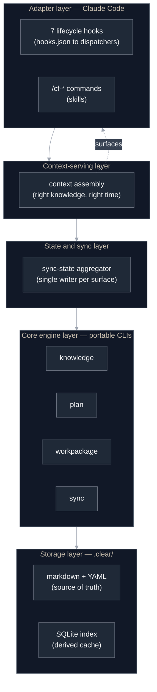
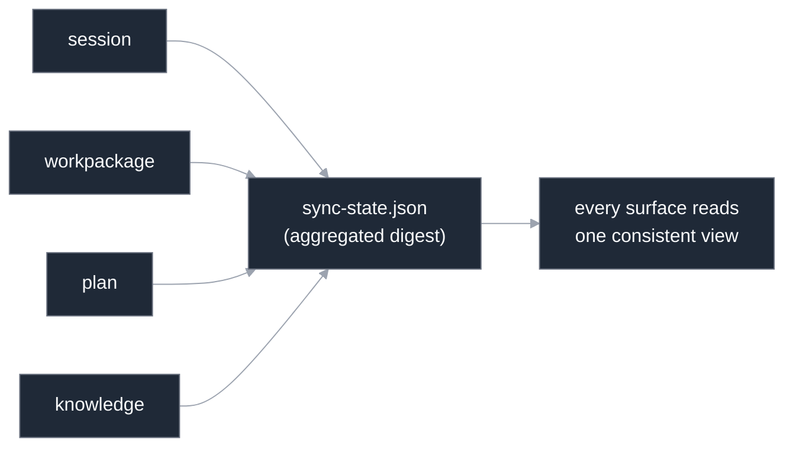
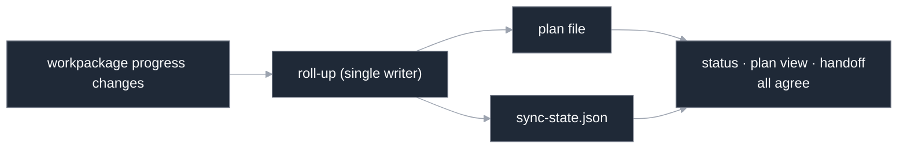
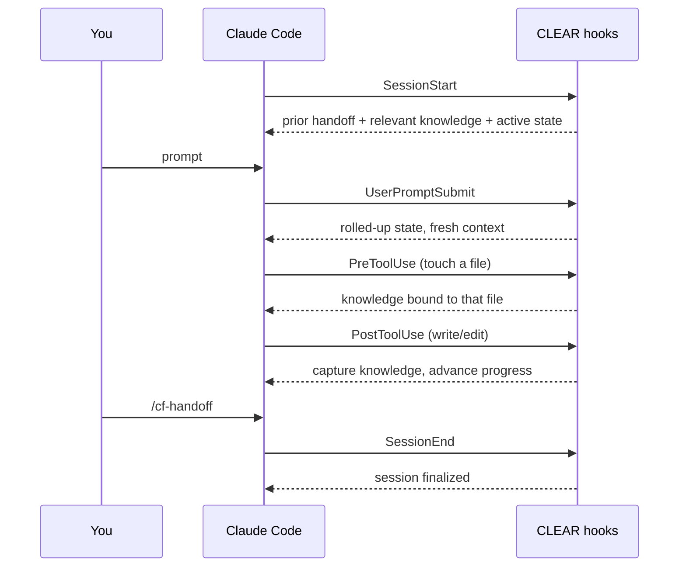
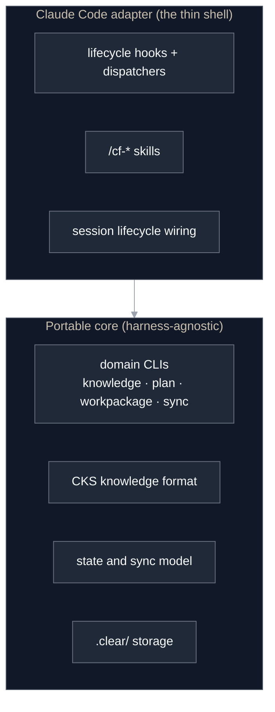
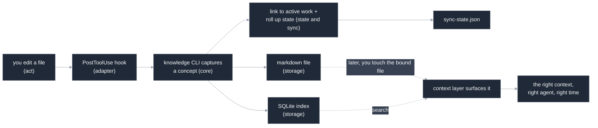

# Architecture

This document explains how CLEAR is built: the layers, how they fit together, how
the shared context layer serves knowledge to the agent, and how state stays correct
across every surface. It is the technical companion to [How CLEAR works](./guides/how-it-works.md),
which covers the same system at a conceptual level.

If you only want to *use* CLEAR, start with [Getting started](./guides/getting-started.md).
Read on if you want to understand the machine, extend it, or port it to another
coding harness.

---

## The layered stack

CLEAR is built in layers. Each layer depends only on the ones beneath it, and the
boundary near the top is deliberate: everything below the adapter is harness-agnostic.



| Layer | What it is | Portable? |
|-------|-----------|:---------:|
| **Storage** | `.clear/` — markdown knowledge, YAML plan/workpackage/session/state files, and a SQLite index. The files are the source of truth; the index is a derived cache. | ✅ |
| **Core engine** | Harness-agnostic TypeScript CLIs for the four domains: knowledge, plan, workpackage, sync. Each has a registry, writer, and parser. | ✅ |
| **State & sync** | Aggregates cross-domain state into one record and propagates changes through a single writer per surface, so nothing drifts. | ✅ |
| **Context-serving** | Assembles the right knowledge and state and hands it to the agent at the right moment. | ✅ (mechanism) |
| **Adapter** | The Claude Code integration: the seven lifecycle hooks, their dispatchers, the `/cf-*` skills, and session wiring. | Claude Code-specific |

The top layer is thin on purpose. The engine, the knowledge format (CKS), the state
model, and the CLIs are all portable; Claude Code is the **first adapter**, not a
requirement. See [Portable core vs adapter](#portable-core-vs-adapter).

---

## The storage layer: `.clear/`

When you run `/cf-init`, CLEAR provisions a `.clear/` directory in your project:

```
.clear/
├── knowledge/      # knowledge entries (markdown) + the SQLite search index
├── plans/          # master-plan.yaml — phases, workpackages, progress
├── workpackages/   # workpackage records
├── sessions/       # session handoffs
├── state/          # sync-state.json — the aggregated cross-domain state
└── config/         # CLEAR configuration
```

Two principles govern this layer:

- **Files are the source of truth.** Every knowledge concept and every plan is a
  diffable file you can read, review, and commit. There is no hidden database of
  record.
- **The index is a derived cache.** The SQLite index under `knowledge/` exists for
  fast full-text search. It is rebuildable from the files at any time and never holds
  state the files do not.

---

## The core engine: portable CLIs

Four domains, each a self-contained TypeScript CLI surface:

| Domain | Responsibility |
|--------|----------------|
| **knowledge** | Capture, index, search, surface, and run the lifecycle (supersede, deprecate, prune) of CKS concepts. |
| **plan** | Create or import plans; track phases, active phase, and rolled-up progress. |
| **workpackage** | Create and track units of work; lifecycle, progress, dependencies. |
| **sync** | Aggregate cross-domain state, propagate changes, detect and repair drift. |

Each domain follows the same internal shape — a **registry** (the in-memory model and
its operations), a **writer** (the only thing that mutates the on-disk files), and a
**parser** (reads files into the model). Routing every mutation through a single
writer is what makes the next layer's correctness guarantees possible.

These CLIs take no dependency on Claude Code. They read and write `.clear/` given a
path, and they are what a port to another harness would reuse unchanged.

---

## The state & sync layer

Naive "memory" systems fail by silent disagreement: the notes say one thing, the
tracker another, and the agent is handed a contradiction. This is the layer built to
prevent that, and to keep CLEAR *correct*.

### The aggregated state record

A single aggregator maintains `.clear/state/sync-state.json` — a digest of every
domain's current state: the active session, the active workpackage (and progress),
the active plan and phase, and a summary of recent knowledge. It is the one place a
surface can read "where things stand" without re-deriving it from four sources.



### Single-writer propagation

State changes propagate through one writer per surface, triggered at well-defined
moments rather than patched into several files that can fall out of step:

- **Session ↔ workpackage** reconcile at session start, so resuming a session is a
  continuation rather than a new one.
- **Workpackage → plan roll-up** runs when progress changes: a workpackage's progress
  flows up into its phase and the plan, on a single canonical 0–100 scale that every
  reader shares.
- **Plan → workpackage propagation** handles scope changes (insert, defer, reorder)
  without breaking references (see [Stable identifiers](#stable-identifiers)).
- **Knowledge ↔ work** links each captured concept to the active work, bidirectionally.

Because there is exactly one writer for each piece of state, the dashboard, the plan
file, the workpackage records, and the aggregated digest cannot disagree.



### Stable identifiers

Every plan, phase, and workpackage carries two identifiers: a **stable identifier**
that never changes once assigned, and a **display identifier** derived from position
(for example, a phase's place in the plan). When work is reordered or a phase is
inserted, only the display identifiers shift; the stable identifiers, and every
reference, link, and piece of bound knowledge that uses them, stay intact. This is
what lets the plan be reshaped without orphaning knowledge or breaking cross-links.

### Drift detection and repair

State can still be disturbed from outside: a hand-edit, an interrupted operation, a
restored backup. CLEAR can detect divergence between the files and the aggregated
digest and repair it: the index rebuilds from the knowledge files, and the aggregated
state reconciles from the domain files. The files remain the source of truth; repair
means re-deriving the caches and the digest from them.

---

## The shared context layer

This is the layer that delivers CLEAR's core promise — *the right context, to the
right agent, at the right time.* It assembles knowledge and state and hands them to
the agent at specific moments in the session, so an agent never has to go looking.

- **At session start**, it loads the previous session's handoff, the knowledge
  relevant to where you left off, and the active plan and workpackage.
- **As you work**, when a file you have a concept bound to comes into play, the
  related decisions, patterns, and lessons surface, including the lifecycle status,
  so a superseded or deprecated concept is presented *as such* rather than as current
  truth.
- **On each turn**, recent state changes roll up so the picture stays current.

The agent is handed assembled context. It does not query a knowledge base; the
context layer serves the base to it.

---

## The adapter layer: Claude Code

CLEAR integrates with Claude Code through two mechanisms.

### The seven lifecycle hooks

`hooks.json` binds a script to each point in the Claude Code session lifecycle. Each
fires the corresponding dispatcher:

| Hook | Fires when | What CLEAR does |
|------|-----------|------------------|
| **SessionStart** | A session begins | Reconcile session ↔ workpackage state; load the prior handoff and relevant knowledge into context. |
| **UserPromptSubmit** | You send a message | Roll up progress; keep the served context current. |
| **PreToolUse** | Before a read/write/search/command | Surface knowledge bound to the files in play; guard protected writes. |
| **PostToolUse** | After a write or edit | Capture knowledge; advance deliverable progress; run quality checks. |
| **PreCompact** | Before context compaction | Preserve essential state so nothing is lost to compaction. |
| **Stop** | The agent finishes a turn | Surface follow-up workflows when warranted. |
| **SessionEnd** | A session ends | Finalize and record session state. |



### The `/cf-*` skills

The commands — `/cf-init`, `/cf-plan`, `/cf-workpackage`, `/cf-knowledge`,
`/cf-status`, `/cf-handoff`, `/cf-reload`, `/cf-help`, `/cf-debug` — are the explicit
surface. Under the hood, each skill calls the same portable core CLIs. The skill is
the Claude Code-shaped wrapper; the CLI is the portable engine.

---

## Portable core vs adapter

The boundary between the portable core and the Claude Code adapter is real, not
aspirational:



- **Portable:** the domain CLIs, the [CKS knowledge format](../CKS.md), the state and
  sync model, and the `.clear/` storage. None of it knows what Claude Code is.
- **Claude Code-specific:** the hooks and their dispatchers, the `/cf-*` skills, and
  the session lifecycle wiring — the layer that translates Claude Code's lifecycle
  events into core-CLI calls.

A port to another coding harness (Codex, Cursor, Aider, Gemini CLI) reimplements
only the adapter: bind that harness's lifecycle events to the same core CLIs. The
engine, the format, and the state model come along unchanged. This is the
direction behind [*Built to be ported*](../README.md#built-to-be-ported).

---

## How it all comes together

A single capture-to-serve cycle touches every layer:



The decision you made while editing becomes a concept bound to that file, indexed,
linked to the work you are doing, and rolled into the project's state. It then
resurfaces, with its lifecycle intact, the next time that code is in play.

---

## Where to go next

- [How CLEAR works](./guides/how-it-works.md) — the conceptual version of this document.
- [The knowledge system](./guides/knowledge-system.md) — the CKS model in depth.
- [Plan](./guides/plan-management.md) · [Workpackage](./guides/workpackage-management.md) · [Session](./guides/session-management.md) management — the workflow surfaces.
- [`CKS.md`](../CKS.md) — the formal knowledge spec.
