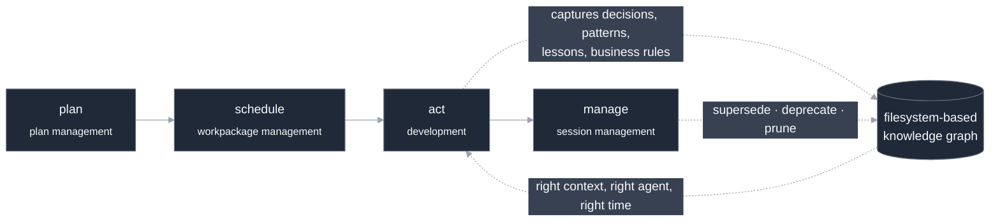

# How CLEAR works

CLEAR turns each coding session from a cold restart into one that carries context
forward. It does this with two visible pillars that are really one system. This
guide explains the pillars, the loop that drives them, and why the two are
inseparable.

New to CLEAR? Start with [Getting started](./getting-started.md). For the knowledge
model in depth, see [The knowledge system](./knowledge-system.md).

---

## Two pillars, one spine

### Pillar 1 — a living, filesystem-based knowledge graph

CLEAR maintains a **markdown knowledge base, not a graph database.** There is no
Neo4j, no server, no proprietary store — just diffable files in your repository.
Architectural patterns, technical decisions, lessons learned, and business rules are
captured as *typed, cross-linked concepts bound to the code they describe.*

Two properties make it a graph rather than a pile of notes:

1. **Knowledge is bound to the code it concerns.** Each concept records the files it
   relates to. Touch one of those files, and the decisions and patterns attached to
   it surface automatically.
2. **The graph stays fresh.** As development progresses, the knowledge base is
   auto-refreshed — net-new entries, edits, supersession, and deprecation — so it
   prunes itself for relevance instead of rotting into stale advice.

### Pillar 2 — a structured development workflow

CLEAR makes the development loop explicit and keeps agents inside it:

> **plan → schedule → act → manage**

- **plan** — capture intent as a plan with phases.
- **schedule** — break the plan into workpackages, each a trackable unit of work.
- **act** — build; this is where code and knowledge are produced.
- **manage** — track status and hand off cleanly between sessions.

### The spine

The two pillars are one system because **the workflow is the engine that grows and
refreshes the graph.** Every plan, workpackage, decision, and lesson flows into the
knowledge graph as you work, bound to code. The loop's *progression* is what triggers
pruning: when work moves forward, knowledge it supersedes gets marked, and stale
knowledge is deprecated.

You do not maintain the knowledge base as a side chore. **Building the software
maintains it.**

---

## The loop in detail

### Plan

A **plan** is the high-level intent for what you are building, organized into
phases. You can author a plan directly or import one. The plan is state CLEAR tracks
across sessions: which phase is active, what is done, what is next.

→ Full guide: [Plan management](./plan-management.md).

### Schedule

A **workpackage** is a concrete unit of work with acceptance criteria. The *active*
workpackage is CLEAR's notion of "what you are working on right now." Progress is
accounted on a single canonical scale, so every surface — status output, the plan
view, the session handoff — agrees on how far along you are.

→ Full guide: [Workpackage management](./workpackage-management.md).

### Act

This is ordinary development. What CLEAR adds is automatic capture: as you make
decisions and discover patterns, they are recorded as knowledge concepts bound to
the files involved. You can also capture deliberately when something is worth
writing down. The payoff comes later, when you (or a future session) touch a bound
file and the relevant knowledge surfaces without anyone searching for it.

→ Full guide: [The knowledge system](./knowledge-system.md).

### Manage

At the end of a session you write a **handoff** — a structured summary of what
happened, what was decided, and what comes next. The next session reads it on
startup. Combined with the knowledge graph, this is what makes session N+1
continuous with session N rather than a cold restart.

→ Full guide: [Session management](./session-management.md).

---

## How knowledge stays in sync with state

CLEAR keeps two things in agreement: the **knowledge graph** and the **project
state** (active plan, active workpackage, progress). It does this with a
**single-writer state model** — every state-bearing surface has one authoritative
writer, so the dashboard, the plan file, and the workpackage records cannot drift
into disagreement. When a piece of work completes, its state change propagates
through that single writer rather than being patched into several places that can
fall out of step.

This matters because the failure mode of naive "memory" systems is silent
disagreement: the notes say one thing, the tracker says another, and the agent is
handed a contradiction. CLEAR's state model is built to prevent exactly that.

Under the hood, CLEAR keeps a single aggregated state record current and serves it,
together with the relevant knowledge, back to the agent as the **shared context
layer** — the mechanism that hands you the right context at the right moment instead
of making you search for it.

→ For the full picture — the layered stack, the shared context layer, the
single-writer state model, and the portable-core/adapter boundary — see
[Architecture](../architecture.md).

---

## Continuity across sessions

When you restart Claude Code in a CLEAR project, startup:

- loads the previous session's handoff;
- surfaces the knowledge relevant to where you left off;
- restores the active plan and workpackage.

The result is the thing CLEAR exists to deliver: **the right context, served to the
right agent, at the right time** — and coding agents that stay on-track instead of
going haywire.

---

## Where to go next

The four workflow surfaces, each in depth:

- [The knowledge system](./knowledge-system.md) — the seven knowledge types, the
  lifecycle, and how CLEAR's spec (CKS) relates to Google's OKF.
- [Plan management](./plan-management.md) — plans, phases, creating and importing.
- [Workpackage management](./workpackage-management.md) — units of work, lifecycle,
  progress, and dependencies.
- [Session management](./session-management.md) — sessions, handoffs, and continuity.

And the deeper references:

- [Architecture](../architecture.md) — the layered stack, the shared context layer,
  and the single-writer state model.
- [`CKS.md`](../../CKS.md) — the formal knowledge spec.
- [Getting started](./getting-started.md) — install and your first loop.
