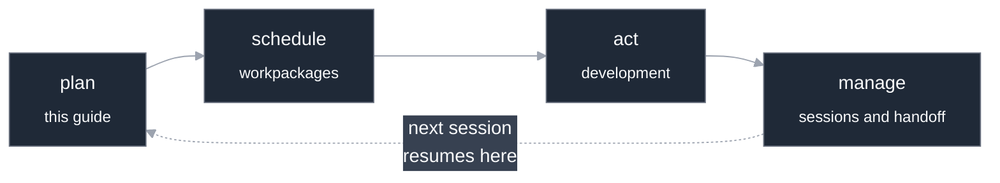
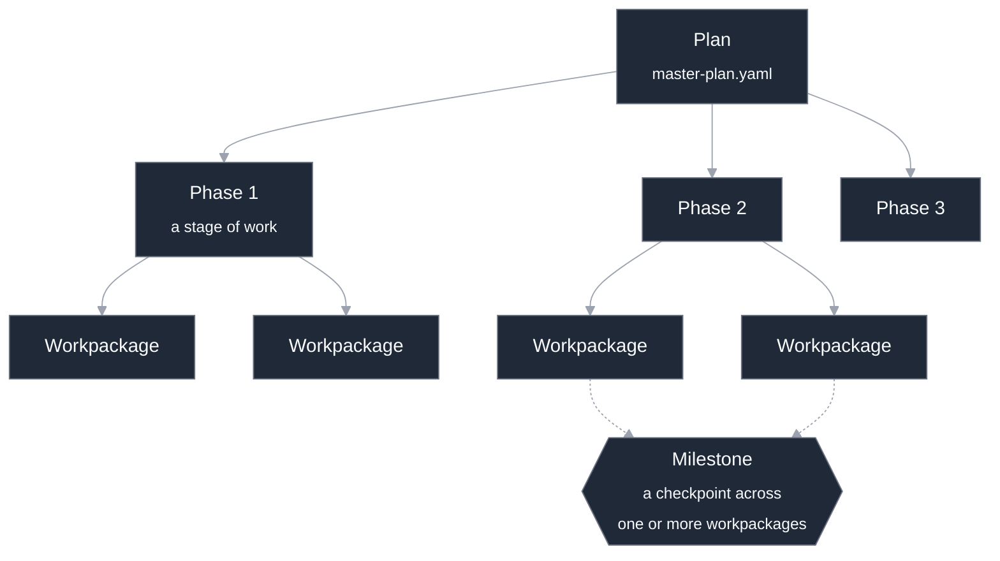
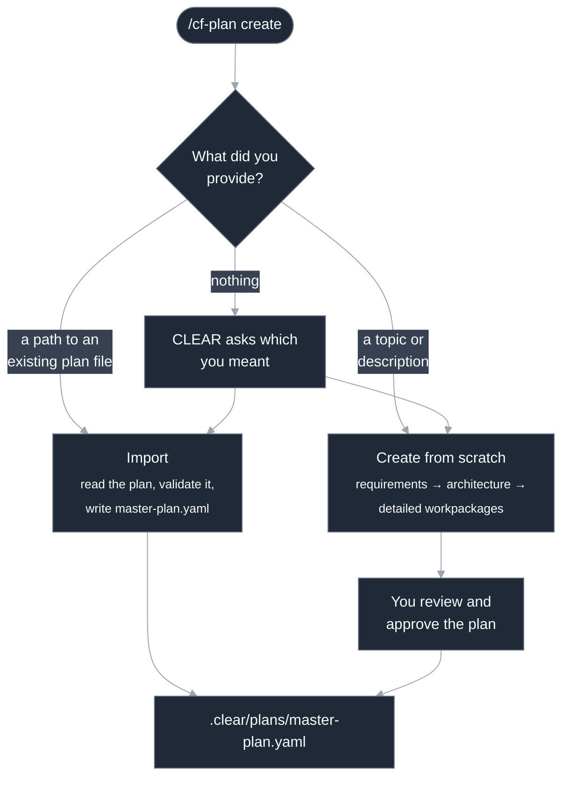

# Plan management

A **plan** is the high-level intent for what you are building. It is the first
stage of CLEAR's development loop, **plan → schedule → act → manage**, and it is
the structure everything else hangs from. Phases group the work, workpackages sit
beneath the phases, and milestones mark the points worth declaring done.

This guide explains the plan model, the two ways to get a plan into a project, and
how CLEAR tracks plan state across sessions. For where planning sits in the larger
picture, see [How CLEAR works](./how-it-works.md). For the exact command flags, see
the [`/cf-plan` reference](../reference/cf-plan.md).

---

## What a plan is, and where it sits

CLEAR makes the development loop explicit:



The plan is the *plan* stage. It captures what you intend to build and breaks that
intent into phases. It is also **state CLEAR tracks for you**: which phase is
active, how far along each phase is, and what to work on next. You author a plan
once, and from then on CLEAR keeps it in step with the work.

A plan is not a static document you maintain by hand. As workpackages complete,
their progress rolls up into the phase that owns them, and the phase's progress
rolls up into the plan. The plan view you see in any session reflects the real
state of the work, not a snapshot someone remembered to update.

---

## The plan model

A plan has three nested levels plus one cross-cutting concept.



### The plan

The top level. A plan has a name, an overall status, a pointer to the **active
phase**, and a pointer to the **active workpackage**. Everything else lives in its
phases and milestones.

### Phases

A **phase** is a stage of the project, such as "Foundation," "Core domain," or
"UI." Each phase has:

- a stable display name you refer to it by, such as `Phase-1`;
- a **status**: `not_started`, `in_progress`, `complete`, `blocked`, or `deferred`;
- a list of the **workpackages** it contains;
- a **progress** figure (0–100), computed from those workpackages;
- optional **dependencies** on other phases that must finish first.

Phases keep their identity for the life of the plan. Adding or removing a phase
renumbers the *order* of the others but does not rename them, so references to a
phase stay valid as the plan grows.

### Workpackages

A **workpackage** is a concrete, trackable unit of work with acceptance criteria,
the thing you actually do during the *act* stage. Workpackages belong to a phase
and are listed in it, but their full detail is managed separately. Planning is
where you decide *which* workpackages exist and how they group into phases.
Defining and tracking them is the subject of
[Workpackage management](./workpackage-management.md).

Within a phase, each workpackage carries a **weight**. By default every workpackage
weighs the same, so a phase with four equal workpackages is 25% done when one of
them finishes. You can weight a large workpackage more heavily so it pulls more of
the phase's progress.

### Milestones

A **milestone** is a checkpoint that depends on a set of workpackages (or other
milestones) being complete. It marks a moment worth recognizing, such as
"Foundation complete" or "Release candidate ready." A milestone has a **type**
that decides how it completes:

| Type | How it completes |
|------|------------------|
| `major` | Auto-completes the moment all its requirements are met. |
| `minor` | Same as major — auto-completes; treated as informational. |
| `gate` | **Never** auto-completes. When every requirement is met it reports *ready to declare*, and it stays there until a person explicitly declares it done. |

Use a `gate` for the moments where "the work is finished" and "we are willing to
call it shipped" are different decisions. CLEAR will tell you a gate is ready, but
it will not cross the line for you.

---

## Getting a plan: create or import

There are two ways to put a plan into a project, and `/cf-plan` routes to the
right one based on what you give it.



### Import an existing plan

If you already have a plan, whether it was generated elsewhere, handed to you, or
carried over from another tool, point `/cf-plan` at it. Give it a path to a plan
file, and CLEAR reads it, validates the structure, indexes the phases, extracts the
workpackages, and writes the result to your project's plan file in one atomic step.

Import is the fast path when the thinking is already done. CLEAR is the source of
truth for what counts as a valid plan, so it does the parsing and validation rather
than trusting the file as-is.

### Create from scratch

If you only have an idea, such as a topic, a brief, or a description of what you
want to build, CLEAR can build the plan for you. Creation runs a short pipeline of
focused agents in sequence:

1. **Requirements** — turn your description into scope and acceptance criteria.
2. **Architecture** — shape that into phases and the structure beneath them.
3. **Detail** — flesh out the individual workpackages.

CLEAR then synthesizes the three into a draft plan and **shows it to you for
approval before anything is written**. Nothing lands in your project until you say
so. After the plan is written, CLEAR offers to create the individual workpackage
files for each unit of work, or to defer that until later.

Either way, the end state is the same: a plan CLEAR can track. Import when the plan
exists; create from scratch when it does not.

> CLEAR never writes plan files by hand-editing. Both paths go through CLEAR's own
> plan writer, which is what guarantees the file is valid and that every other
> surface, including the status view and the progress rollup, can read it back.

---

## Where plan state lives

A plan is stored as plain files in your project, under `.clear/`:

```
.clear/
└── plans/
    └── master-plan.yaml    # the plan: phases, workpackages, milestones, active pointers
```

`master-plan.yaml` is the durable plan. It is a normal file: you can diff it,
review it, and commit it alongside your code. Here is the shape of a real one,
trimmed:

```yaml
version: '1.0'
projectName: Book Library API
status: active
activePhase: Phase-2          # the phase you are currently in
activeWorkpackage: ''         # the unit of work in progress, if any
phases:
  - id: Phase-1
    name: Foundation
    status: complete
    progress: 100
    workpackages: [P1.1, P1.2, P1.3, P1.4]
    weights: {P1.1: 1, P1.2: 1, P1.3: 1, P1.4: 1}
  - id: Phase-2
    name: Core domain
    status: in_progress
    progress: 50
    workpackages: [P2.1, P2.2, P2.3, P2.4]
    weights: {P2.1: 1, P2.2: 1, P2.3: 1, P2.4: 1}
milestones:
  - id: M-1
    name: Foundation complete
    phase: Phase-1
    type: major
    requires: [P1.1, P1.2, P1.3, P1.4]
    status: complete
```

Alongside the plan, CLEAR keeps a small amount of runtime state: the active phase,
when work started, recorded progress, and milestone status. That state is what
keeps the plan view consistent every time you open it. You do not edit it directly;
CLEAR writes it as work moves forward.

---

## How progress is tracked

Plan progress is computed, not typed in. The rule is a clean rollup:

- A **workpackage** has its own progress, 0–100.
- A **phase's** progress is the weight-weighted average of its workpackages'
  progress. With equal weights, that is just the average.
- The **plan** reflects the phases.

Because the figure is derived, every surface agrees. The status line, the plan
view, and the session handoff all read the same rollup, so you never hit the case
where one tracker says 40% while another says 70%. When a workpackage completes,
that single change propagates up through the rollup rather than being patched into
several places that can fall out of step. (For the single-writer model that
guarantees this, see [How CLEAR works](./how-it-works.md) and
[the architecture overview](../architecture.md).)

CLEAR also reads a few softer signals to give a fuller sense of momentum: recent
commit activity, the presence of tests and docs, and completed milestones. The
workpackage rollup is the spine; the other signals add texture.

---

## Advancing through phases, and what "next" means

As you finish the work in a phase, you mark the phase complete and move the active
pointer to the next one. The plan always knows which phase is **active**: the phase
CLEAR assumes you are working in when it reports progress or recommends work.

When you ask CLEAR **what to work on next**, it does not just hand you the first
unfinished item. It looks at:

- **dependency order** — work whose prerequisites are done comes first;
- **phase ordering** — it favors the active phase and what follows it;
- **completion status** — finished work is skipped;
- **blockers** — work that is currently blocked is held back.

The result is a single recommendation for the next workpackage to pick up, chosen
so you are not blocked the moment you start it.

---

## Blockers and dependencies

A plan can carry dependencies in two places, and CLEAR surfaces both as
**blockers** when they get in the way:

- **Phase dependencies.** A phase can declare that other phases must finish first.
  If you are in a phase whose prerequisite is not yet complete, that is flagged as
  a high-severity dependency blocker.
- **Milestone risk.** When a milestone is falling behind, meaning time is being
  consumed faster than its required work is getting done, CLEAR raises it as a risk
  so it does not quietly slip.

For each blocker, CLEAR also suggests a way forward: complete the blocking phase
first, reduce scope on an at-risk milestone, or prioritize the requirements that
are lagging. Blockers are advisory. They tell you what is in the way and what to
do about it, but they do not stop you from working.

---

## How plans connect to the rest of the loop

The plan is where the loop starts, and it feeds everything downstream:

- **Workpackages** are the units the plan schedules. The plan lists them and groups
  them into phases; [Workpackage management](./workpackage-management.md) is where
  you define and track each one.
- **Sessions** read the plan on startup. When you begin a new session, CLEAR
  restores the active plan, phase, and workpackage so you resume where you left off
  (see [Session management](./session-management.md)).
- **Knowledge** is produced as you act on the plan. Decisions, patterns, and
  lessons captured during the work bind to the code they concern (see
  [The knowledge system](./knowledge-system.md) and [`CKS.md`](../../CKS.md)).

The plan describes the work. It is also the structure that lets CLEAR keep the right
context flowing to the right place as the work happens.

---

## Command reference

You drive all of this through `/cf-plan`. Ask it for status, progress, blockers, or
a next-step recommendation; use it to create, import, or extend a plan. Every
operation and its exact flags are in the [`/cf-plan` reference](../reference/cf-plan.md).
When you are unsure of any command's options, ask it directly with `--help`.

---

## Where to go next

- [`/cf-plan` reference](../reference/cf-plan.md) — every plan operation and its flags.
- [Workpackage management](./workpackage-management.md) — the units of work beneath the phases.
- [Session management](./session-management.md) — how the plan carries across sessions.
- [How CLEAR works](./how-it-works.md) — the loop the plan sits at the head of.
- [Getting started](./getting-started.md) — install and your first plan.
- [Architecture](../architecture.md) — the state model that keeps progress consistent.
