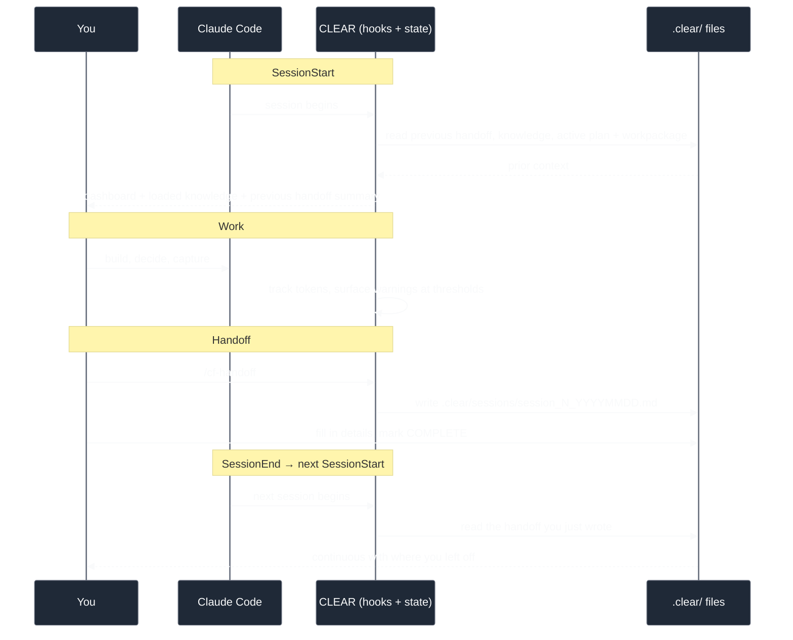
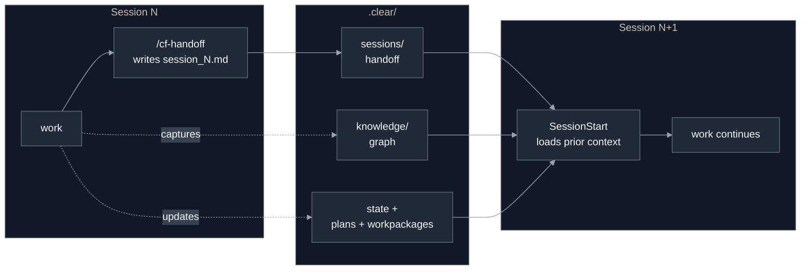

# Session management

A coding session normally starts cold. The agent has no memory of the last one: what
you decided, how far you got, what to do next. CLEAR closes that gap. Session
management is the **manage** stage of the development loop, and it makes
session N+1 continuous with session N instead of a fresh restart every time.

This guide explains what a session is, how the lifecycle works, what a handoff
captures, and how continuity carries state forward. For the loop this stage belongs
to, see [How CLEAR works](./how-it-works.md). For the knowledge that travels
alongside a session, see [The knowledge system](./knowledge-system.md).

---

## Where "manage" sits in the loop

CLEAR makes the development loop explicit:

> **plan → schedule → act → manage**

The first three stages produce intent, units of work, and code. The fourth keeps it
all coherent over time. **Manage** is where you track current state and hand off
cleanly between sessions, so the work that happened this session is available to the
next one rather than lost when the context window closes.

A session, in CLEAR's terms, is one continuous engagement with Claude Code in your
project. It has a number, a start time, a running estimate of how much of the context
budget it has consumed, and an active workpackage. When the session ends, it can
leave behind a **handoff** — a structured document the next session reads on startup.

---

## The session lifecycle

Every session follows the same shape: startup loads the prior context, you work, and
at the end you write a handoff that the *next* startup will load.

### Startup

When you start (or `/clear`, or compact) a session in a CLEAR project, the SessionStart
hook reloads context before you type anything. It:

- loads the **previous session's handoff** — the summary and the next-session
  priorities you wrote;
- surfaces the **knowledge** relevant to where you left off;
- restores the **active plan and workpackage** — which phase is active, what you were
  working on, how far along it is;
- renders a **status dashboard** so the current state is the first thing you see.

This is the payoff of having written a handoff last time. Startup is not a blank
slate; it is a briefing.

### Work

During the session you build. CLEAR tracks token consumption in the background and
surfaces a warning as you approach each threshold, so you can wrap up and hand off
before the context window runs out rather than after. You can check the current state
at any point with [`/cf-status`](../reference/cf-status.md).

### Handoff

Before you stop, you write a handoff with [`/cf-handoff`](../reference/cf-handoff.md).
It captures what happened, what was decided, and what comes next in a structured
document under `.clear/sessions/`. This is the single most important habit in session
management: **a session without a handoff is a session the next one cannot read.**

### End and restart

When the next session starts, the cycle closes. SessionStart finds the handoff you
wrote and loads its summary and priorities back into context, alongside the refreshed
knowledge and restored plan state. The next session begins where this one ended.

---

## The handoff document

The handoff is a single markdown file written to `.clear/sessions/`, named
`session_<N>_<YYYYMMDD>.md`. It has two parts: a **YAML frontmatter block** that holds
all the machine-readable metrics, and a **markdown body** of human-readable context.
The body is organized into a fixed set of sections.

| Section | What it captures |
|---------|------------------|
| `## Summary` | One or two sentences on what the session accomplished. |
| `## Completed Items` | What got finished this session. |
| `## In Progress` | The task still underway, if any. |
| `## Technical Decisions` | Key decisions with their rationale and impact. |
| `## Patterns Established` | Patterns set or refined this session. |
| `## Learnings` | Discrete lessons discovered this session. |
| `## Patterns Observed` | Patterns noticed but not yet established as canonical. |
| `## Changes This Session` | Knowledge, plan, and workpackage changes, plus deprecations. |
| `## Code Changes` | A table of files touched, by type. |
| `## Test Results` | The test tally at session close. |
| `## Next Session Priorities` | The ordered list of what to do next. |
| `## Blockers / Unresolved` | Anything left open or stuck. |
| `## Resume` | The command to resume this exact session. |

These section names are the canonical handoff format. Startup parses two of them,
`## Summary` and `## Next Session Priorities`, and replays them into the next
session's context, which is why those two carry the most weight. Write them as if a
fresh agent will read nothing else.

The frontmatter records identity (`session`, `date`, `workpackage`, `branch`,
`status`), token metrics, file and line counts, documentation counts, test results,
and metadata such as `complexity` and `decisions_count`. The `status` field
(`PARTIAL`, `COMPLETE`, or `BLOCKED`) matters beyond bookkeeping: only handoffs marked
complete are picked up for metrics collection, so a half-finished handoff never
pollutes your project's history.

### The retrospective sections tie back to knowledge

Four of the sections (Technical Decisions, Patterns Established, Learnings, and
Patterns Observed) line up with CLEAR's knowledge types. If you captured a decision,
pattern, or lesson during the session with [`/cf-knowledge`](../guides/knowledge-system.md),
note its knowledge ID in the matching handoff section. That keeps the handoff and the
knowledge graph pointing at the same facts. Items written into the handoff without an
ID document the content for a human reader but are not registered as knowledge
entries.

---

## How continuity works across sessions

Continuity is not magic; it is three things being loaded in agreement at startup: the
handoff, the knowledge, and the project state.

The handoff carries the **narrative** — what happened and what is next. The knowledge
graph carries the **durable facts** — decisions and patterns bound to the code they
concern, surfaced when you touch that code again. The project state carries the
**position** — the active plan phase, the active workpackage, and its progress.

These three stay in agreement because CLEAR uses a single-writer state model: every
state-bearing surface has one authoritative writer, so the dashboard, the plan file,
and the workpackage records cannot drift into contradiction. When work completes, the
change propagates through that one writer rather than being patched into several
places that can fall out of step.

---

## Checking state mid-session

[`/cf-status`](../reference/cf-status.md) shows the current session at a glance: the
session number, token usage against the warning, critical, and emergency thresholds,
the active workpackage and phase, and a context health check that flags missing
pieces (no master plan, no knowledge linked to the active workpackage). Run it
whenever you want to know where you stand — especially as token usage climbs and you
are deciding whether to wrap up.

CLEAR tracks token consumption against three thresholds, with defaults of:

| Threshold | Default | What it means |
|-----------|---------|---------------|
| Warning | 60% | Consider wrapping up the current task. |
| Critical | 75% | Begin handoff preparation. |
| Emergency | 85% | Stop new work, finalize the handoff immediately. |

These defaults are configurable per project in `.clear/config/session-management.yaml`.
At the critical threshold CLEAR also prepares a handoff document automatically, so the
scaffold exists even if you forget to run the command. An auto-generated handoff
starts with placeholder metrics; you still review and complete it before it counts.

---

## Reloading state mid-session

Sometimes the context CLEAR loaded at startup goes stale during a session — usually
because you edited a `.clear/` file by hand, or context was disrupted. `/cf-reload`
forces a fresh load of all CLEAR domain context (knowledge, workpackage, and plan)
into the current session, without reinitializing the project. It re-runs the same
startup reload that happens at the beginning of a session, so the state you see is
back in sync with the files on disk. See [`/cf-reload`](../reference/cf-reload.md)
for details.

You do not need to run `/cf-reload` at the start of a normal session — startup already
loaded everything. Reach for it only when something drifted out from under you.

---

## Best practices

- **Write a handoff before you stop.** This is the one rule. A session that ends
  without a handoff leaves the next one to reconstruct everything from scratch.
- **Hand off at the critical threshold, not after the emergency one.** When
  `/cf-status` shows you crossing 75%, finish the task in flight and write the
  handoff while you still have budget to write it well.
- **Make `## Summary` and `## Next Session Priorities` self-contained.** Those two
  sections are what the next session loads. Assume the reader knows nothing else.
- **Mark the handoff `COMPLETE`.** Only completed handoffs flow into metrics and read
  cleanly at the next startup. An unfinished handoff with placeholder values helps
  no one.
- **Capture knowledge as you go, not just in the handoff.** A decision worth
  recording belongs in the knowledge graph (via `/cf-knowledge`) so it surfaces
  whenever the relevant code is in play — the handoff is the narrative, the knowledge
  graph is the durable memory.
- **Reload only when state drifted.** `/cf-reload` is for recovery, not routine. At
  normal session start the context is already loaded.

---

## Command reference

| Command | Purpose |
|---------|---------|
| [`/cf-handoff`](../reference/cf-handoff.md) | Generate or preview the session handoff document. |
| [`/cf-status`](../reference/cf-status.md) | Show current session, token usage, and context health. |
| [`/cf-reload`](../reference/cf-reload.md) | Reload CLEAR context into the current session. |

---

## Where to go next

- [How CLEAR works](./how-it-works.md) — the full plan → schedule → act → manage loop.
- [Plan management](./plan-management.md) — the intent the loop tracks across sessions.
- [Workpackage management](./workpackage-management.md) — the active unit of work a
  session carries.
- [The knowledge system](./knowledge-system.md) — the durable facts that travel
  alongside each session.
- [Getting started](./getting-started.md) — install and run your first loop.
- [Architecture](../architecture.md) — how the pieces fit under the hood.
- [`CKS.md`](../../CKS.md) — the formal knowledge specification.
