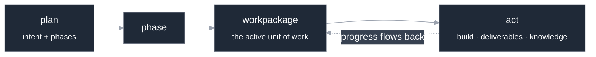
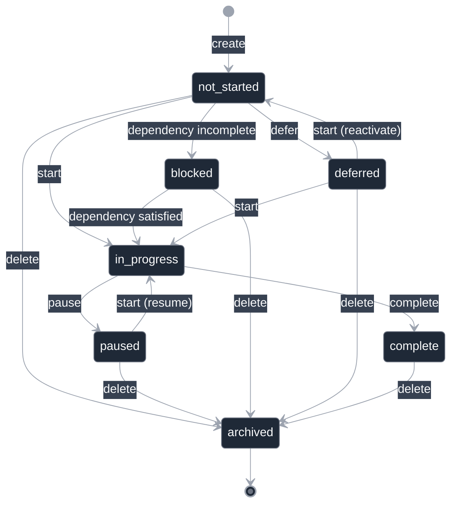
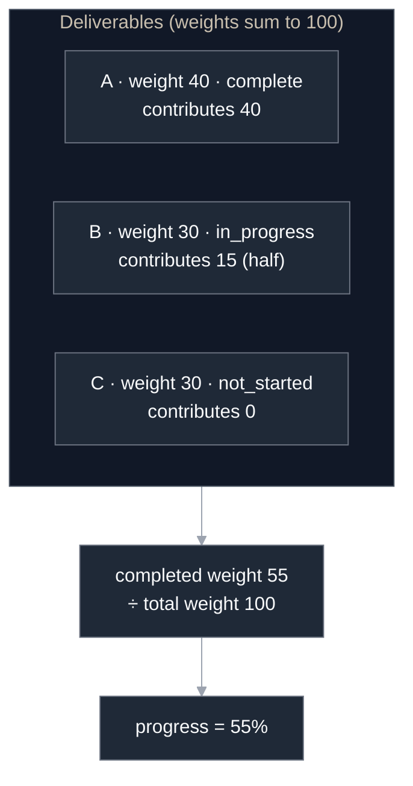
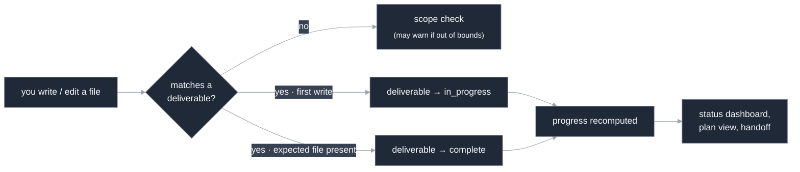
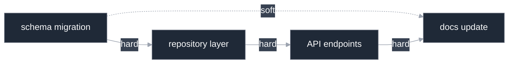
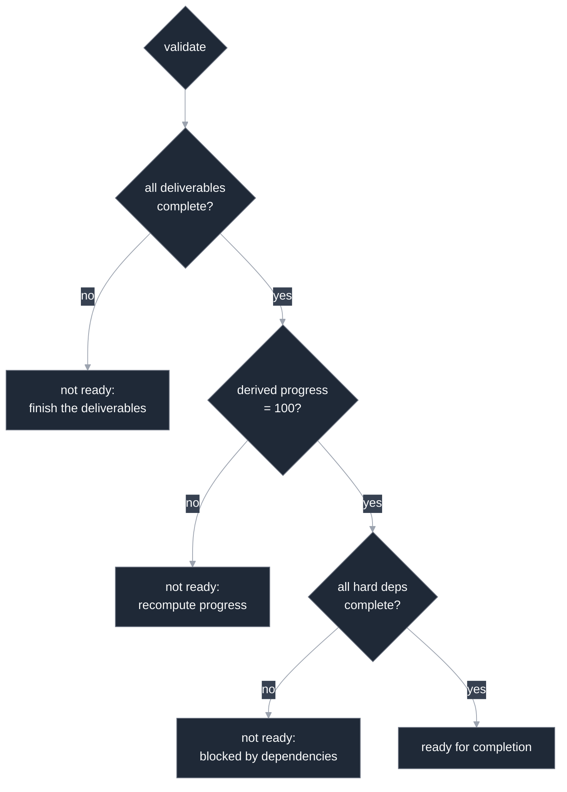

# Workpackage management

A **workpackage** is the unit of work CLEAR tracks. It is the *schedule* stage of the
development loop, the step between a high-level plan and the act of building. A
workpackage is concrete and trackable: it has acceptance criteria, deliverables, a
status, and a single progress number. The one you are working on right now is the
**active workpackage**, which is CLEAR's notion of "what you are doing."

This guide is the in-depth tour of the model and its lifecycle. For the operations and
their flags, see the [command reference](../reference/cf-workpackage.md). For where
workpackages sit in the larger loop, see [How CLEAR works](./how-it-works.md).

---

## Where a workpackage sits in the loop

CLEAR makes the development loop explicit:

> **plan → schedule → act → manage**

A **plan** is the high-level intent, organized into phases. A **workpackage** breaks a
phase down into a trackable chunk of work. You *act* by building against the active
workpackage, and you *manage* by tracking progress and handing off between sessions.

Plans live alongside knowledge under your project's `.clear/` directory; a consumer's
workpackages are tracked under `.clear/workpackages/`. You do not edit those files by
hand. The commands described here are the writers, so the records, the progress
counters, and the status dashboard stay in agreement.

---

## What a workpackage is made of

A workpackage carries a small, fixed set of fields. The important ones for day-to-day
work:

| Field | What it holds |
|-------|---------------|
| Title | A short, human-readable name for the work. |
| Status | Where the workpackage is in its lifecycle (see below). |
| Type | `feature`, `bugfix`, `refactor`, `documentation`, or `infrastructure`. |
| Priority | `critical`, `high`, `medium`, or `low`. |
| Description | What the work is. |
| Acceptance criteria | The conditions that define "done" — what must be true to accept the work. |
| Deliverables | The concrete artifacts the work produces, each with a weight and a status. |
| Dependencies | Other workpackages this one waits on. |
| Scope | What is in and out of bounds for this workpackage. |
| Progress | A single number from 0 to 100, derived from the deliverables. |

Two of these deserve a closer look because they drive how CLEAR tracks real work:
acceptance criteria and deliverables.

### Acceptance criteria

Acceptance criteria are the contract for "done." They describe the conditions the work
must satisfy to be accepted, not the steps to get there. They are written for humans
and read by humans; CLEAR stores them and surfaces them, but it does not mechanically
verify each one. When you ask whether a workpackage is ready to complete, CLEAR checks
the things it *can* check automatically (deliverables and dependencies). Confirming the
acceptance criteria are genuinely met is your call.

### Deliverables

A **deliverable** is a concrete artifact the workpackage produces, typically a file or
a set of files. Each deliverable has three things that matter:

- a **status** (`not_started`, `in_progress`, or `complete`);
- a **weight**, a number that says how much this deliverable counts toward the
  workpackage's overall progress;
- an optional **pattern**, a glob that ties the deliverable to the files that fulfill
  it.

Deliverables are the bridge between abstract progress and real file changes. When the
files for a deliverable appear, the deliverable advances, and that is what moves the
progress number. The next two sections explain exactly how.

### The active workpackage

At most one workpackage is **active** at a time. The active workpackage is the one
CLEAR treats as "what you are working on now": it is what progress updates apply to,
what the status dashboard centers on, and what a session handoff records as your
current focus. Starting a workpackage makes it active; pausing or completing it clears
that slot.

---

## The lifecycle

Every workpackage has a **status**, and the moves between statuses are governed by a
state machine. You cannot jump to an arbitrary status; only the valid transitions are
allowed (with one deliberate override, described below).

| Status | Meaning |
|--------|---------|
| `not_started` | Created but not yet begun. |
| `in_progress` | Active; the workpackage you are working on. |
| `paused` | Explicitly set aside; resumable. |
| `blocked` | Waiting on an incomplete dependency. Set by the system, not by hand. |
| `complete` | Finished and accepted. |
| `deferred` | Pushed out for later, with an optional reason. |
| `archived` | Soft-deleted. Hidden from default views but kept on disk. Terminal. |

A few rules in that diagram are worth calling out, because they are intentional:

- **You start a workpackage to make it active.** Starting moves `not_started`,
  `paused`, or `deferred` into `in_progress`. Resuming a paused workpackage is the same
  action.
- **You cannot archive an active workpackage directly.** An `in_progress` workpackage
  must be paused first, then deleted. This is a guard against accidentally throwing away
  the thing you are in the middle of.
- **`blocked` is the system's call, not yours.** CLEAR marks a workpackage blocked when
  a hard dependency is incomplete, and unblocks it when the dependency finishes. You do
  not set `blocked` by hand.
- **Deferring is reversible.** A deferred workpackage can be reactivated later with a
  start, either back to `not_started` or straight into `in_progress`.
- **Archived is terminal.** Once archived, a workpackage has no transitions out. It is
  preserved on disk for history but removed from active views.

### Starting, pausing, deferring, completing

- **Start** activates a workpackage. If it has unmet hard dependencies, the start is
  refused unless you override it; CLEAR tells you which dependencies are incomplete.
- **Pause** sets the active workpackage aside at its current progress, leaving no
  workpackage active. You resume it later by starting it again.
- **Defer** pushes a workpackage out for later and records an optional reason. Use it
  when work is descoped or postponed rather than abandoned.
- **Complete** finishes the active workpackage. CLEAR validates completion readiness
  first (see [Completion readiness](#completion-readiness-and-validation)).

### Reordering

Workpackages within a phase have an order, and that order is part of how their
user-facing identifier is formed. **Reordering** moves a workpackage to a new position
within its phase. Because the user-facing identifier is derived from position, reordering
changes it, which is why CLEAR also keeps a stable internal identifier that never moves
(see [Identifiers](#identifiers-display-vs-stable)).

---

## Progress: one number, derived from real work

Progress is a single number from **0 to 100**. Every surface that shows progress (the
status dashboard, the plan view, the session handoff) reads this same canonical scale,
so they cannot disagree about how far along you are.

The number is **derived, not declared.** You do not type "we're at 60%." Progress is
computed from the deliverables: each deliverable contributes in proportion to its weight,
and its contribution depends on its status.

- A `complete` deliverable contributes its **full** weight.
- An `in_progress` deliverable contributes **half** its weight.
- A `not_started` deliverable contributes **nothing**.

The result is the completed weight as a percentage of the total weight, rounded to a
whole number.

Weights are relative, so any positive scale works mathematically; the magnitude is
cosmetic because the calculation is a ratio. The convention CLEAR follows is to make a
workpackage's weights **sum to 100**, so a deliverable's weight reads directly as its
share of the work. A single-deliverable workpackage usually gives that deliverable a
weight of 100. (If every deliverable is left at weight 0, CLEAR falls back to counting
each deliverable equally, a compatibility path rather than a deliberate choice for new
work.)

Because progress is derived, you cannot set it to an arbitrary value. The one meaningful
manual override is setting progress to **100**, which sweeps every deliverable to
`complete` in one coherent move. It is useful when the work is genuinely finished and you
want to close out the bookkeeping at once.

### Deliverable auto-promotion: progress tracks your edits

Here is the mechanism that ties the progress number to the actual code you write. As you
work, CLEAR watches the files you create and edit (through the same hook that records
knowledge), and it advances deliverables automatically:

- The **first** time you write a file that matches a deliverable (by its pattern, or by a
  file the deliverable's description names), that deliverable moves from `not_started` to
  `in_progress`.
- When the file the deliverable expects is **present on disk**, the deliverable moves on
  to `complete`.

So progress climbs as the real artifacts appear. You rarely touch deliverable status by
hand; building the workpackage advances it for you.

There is one wrinkle worth knowing. If you write a **stub or placeholder** that happens
to satisfy the file-present check, the deliverable can promote to `complete` before the
work is truly done. You can walk that back: set the deliverable's status
back to `in_progress` explicitly, finish the real implementation, and let it re-promote.
The [command reference](../reference/cf-workpackage.md#revert-premature-promotion)
spells out the exact command.

### Scope, lightly enforced

A workpackage's scope lists what is in and out of bounds. When you write a file that does
**not** match any deliverable, CLEAR does a scope check and may emit a gentle warning if
the file looks outside the workpackage's intended area. The enforcement is deliberately
light: scope items written as plain prose are treated as descriptive guidance, not hard
rules. A file that matches a deliverable is, by definition, in scope, so no warning. The
point is to nudge, not to block.

---

## Dependencies between workpackages

Workpackages can depend on one another. A dependency says "this work waits on that work."
Dependencies come in two strengths:

- A **hard** dependency *blocks*. You cannot start the dependent workpackage until the
  one it needs is complete, not without an explicit override.
- A **soft** dependency *warns* but does not block. It records a relationship and a
  recommended order without stopping you.

A dependency can also be narrowed to specific **deliverables**: rather than waiting on a
whole upstream workpackage, it can wait on just the deliverables it actually needs from
that workpackage.

In this example, the repository layer is **blocked** until the schema migration is
complete; the API endpoints are blocked until the repository layer finishes; and the docs
update has a soft tie to the migration (a suggested order) plus a hard tie to the
endpoints (it genuinely needs them). A completed *or archived* upstream workpackage
counts as satisfied, so archiving a workpackage you have decided not to do unblocks
whatever was waiting on it.

CLEAR detects **circular** dependencies, a chain that loops back on itself, and reports
the cycle rather than letting you wedge the project. When a workpackage is blocked, CLEAR
can also point you at **alternatives**: other unblocked workpackages you could pick up
instead.

You can ask CLEAR about a workpackage's dependencies at any time to see what is blocking
it, what is merely a soft tie, and whether the chain is sound.

---

## Completion readiness and validation

Before you mark a workpackage complete, you can ask CLEAR whether it is ready. The
readiness check is a small, honest gate over the things CLEAR can verify mechanically:

1. **Deliverables** — are all of them complete?
2. **Progress** — does the derived progress reach 100? (Progress follows from the
   deliverables, so if any deliverable is incomplete, this is a consequence, not a
   separate failure — CLEAR reports the deliverables as the root cause.)
3. **Dependencies** — are all hard dependencies complete?

This gate is about *mechanical* readiness. It does not, and cannot, confirm that your
acceptance criteria are genuinely met; that judgment is yours. A workpackage with no
deliverables at all is gated on its dependencies alone, so it stays completable.

When you are confident the work is truly done but the gate disagrees (for instance, you
have verified the outcome by other means), you can **force** completion. Forcing is a
deliberate override, not the normal path; reach for it knowingly.

---

## How workpackages connect to plans and across sessions

Workpackages do not float on their own. Each one belongs to a phase of a plan, and the
plan tracks which phase is active and what is done. Completing workpackages is how a
phase, and ultimately a plan, advances. See [Plan management](./plan-management.md)
for the plan side of that relationship.

Progress and status are **state CLEAR carries across sessions.** When you restart Claude
Code in a CLEAR project, startup restores the active workpackage and its progress, reads
the previous session's handoff, and surfaces the knowledge relevant to where you left
off. So the workpackage you were on is still the workpackage you are on, and the next
session is continuous with the last rather than a cold restart. See
[Session management](./session-management.md) for how handoffs carry that context.

This continuity is held together by CLEAR's **single-writer state model**: every
state-bearing surface has one authoritative writer, so the dashboard, the plan file, and
the workpackage records cannot drift into disagreement. When a deliverable advances or a
workpackage completes, the change flows through that one writer rather than being patched
into several places that could fall out of step. The knowledge captured while you build
is bound to the same code your deliverables touch; see [The knowledge system](./knowledge-system.md).

### Identifiers: display vs stable

A workpackage has two identifiers, and it helps to know which is which:

- A **display identifier** is the user-facing name, derived from the phase and the
  workpackage's position within it. It is what you type and what you see in status
  output. Because it is derived from position, **it changes when you reorder
  workpackages.**
- A **stable identifier** is an internal slug that never changes once assigned. You will
  mostly encounter it in error messages and logs.

For everyday work you use the display identifier. The stable one exists so that internal
references survive reordering. Commands accept either form.

---

## Command reference

For every operation, its real flags, and worked examples, see the
[`/cf-workpackage` command reference](../reference/cf-workpackage.md).

---

## Where to go next

- [`/cf-workpackage` reference](../reference/cf-workpackage.md) — every operation and flag.
- [Plan management](./plan-management.md) — the plan and phases a workpackage lives under.
- [Session management](./session-management.md) — how progress and focus carry between sessions.
- [The knowledge system](./knowledge-system.md) — the knowledge captured as you build.
- [How CLEAR works](./how-it-works.md) — the full plan → schedule → act → manage loop.
- [Architecture](../architecture.md) — how the pieces fit under the hood.
- [Getting started](./getting-started.md) — install and your first loop.
- [`CKS.md`](../../CKS.md) — the formal knowledge spec.
