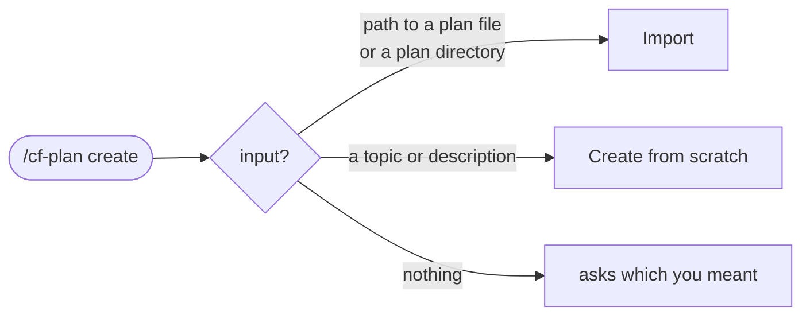

# `/cf-plan` reference

`/cf-plan` is the command for your development **plan**: viewing it, creating or
importing it, and keeping it current. This is the operational reference for what
each plan operation does and the exact flags it takes.

For the concepts behind planning — phases, workpackages, milestones, progress —
start with the [Plan management guide](../guides/plan-management.md).

> **Looking up flags yourself.** You invoke `/cf-plan` and describe what you want,
> and it routes to the right operation. Each operation is backed by a small
> command-line tool, and you can run one directly with `--help` to see its exact,
> current options. `--help` only prints usage; it never touches your plan.

---

## What `/cf-plan` does

`/cf-plan` is a router. You can give it an explicit operation (`/cf-plan status`,
`/cf-plan blockers`), or just say what you want in plain language ("how's the plan
looking?", "create a plan for a REST API") and it picks the matching operation. For
any operation that *changes* the plan, it confirms with you before proceeding when
it inferred your intent rather than being told outright.

Before it does anything, `/cf-plan` checks that CLEAR is initialized in the
project. If it is not, it tells you to run `/cf-init` first and stops.

There are two kinds of operation:

- **Read operations** — `status`, `progress`, `blockers`, `next`, `phases`. These
  only report; they never change the plan.
- **Write operations** — `create`, adding a phase, and `update`. These change the
  plan, and always go through CLEAR's own writers so the file stays valid.

---

## The consumer default: `--clear-dir`

CLEAR stores your plan under a `.clear/` directory at your project root. The
read operations default to `.clear` (or `./.clear`), so from your project root you
never need to pass the path explicitly. Supply `--clear-dir=<path>` only if your
`.clear/` directory is somewhere non-standard. The create and import operations use
`--cwd=<path>` (project root, default `.`) for the same purpose.

---

## Read operations

### Plan overview / status

The default view: the active phase, the active workpackage, and overall progress.
This also runs automatically at the start of every session, so you usually see it
without asking.

```
load-cli --clear-dir=<path>
```

| Flag | Default | Meaning |
|------|---------|---------|
| `--clear-dir=<path>` | `.clear` | Path to the `.clear` directory. |
| `--session-id=<id>` | — | Current session identifier (normally supplied for you). |

### Progress

A progress breakdown across the plan — how far each phase has come, rolled up from
its workpackages.

```
progress-cli --clear-dir=<path>
```

| Flag | Default | Meaning |
|------|---------|---------|
| `--clear-dir=<path>` | `.clear` | Path to the `.clear` directory. |
| `--user-prompt=<text>` | — | Optional context used to detect what you are asking about. |

### Blockers

What is in the way: phase dependencies that are not yet satisfied, and milestones
that are at risk. Each blocker comes with a suggested way forward.

```
blockers-cli --clear-dir=<path> [--phase=<phase-id>]
```

| Flag | Default | Meaning |
|------|---------|---------|
| `--clear-dir=<path>` | `.clear` | Path to the `.clear` directory. |
| `--phase=<phase-id>` | active phase | Limit the check to one phase (for example `Phase-2`). |

### Next workpackage

A single recommendation for what to pick up next, chosen by dependency resolution
and phase ordering so you are not blocked the moment you start.

```
next-cli --clear-dir=<path>
```

| Flag | Default | Meaning |
|------|---------|---------|
| `--clear-dir=<path>` | `.clear` | Path to the `.clear` directory. |

### Phases

List the phases, or show one phase in full.

```
phase-cli list
phase-cli show --id=<phase-id>
```

| Subcommand | Meaning |
|------------|---------|
| `list` | List all phases (the default when no subcommand is given). |
| `show --id=<phase-id>` | Show full detail for one phase, for example `--id=Phase-1`. |

---

## Write operations

### Create or import a plan

`create` is itself a router. What you give it decides which path runs:



Before either path runs, `create` checks whether a plan already exists. If one
does and you did not pass `--force`, it stops and tells you a backup-protected
overwrite needs `--force`.

**Import** an existing plan — point it at a plan file (or a directory containing
one). CLEAR reads, validates, indexes, and writes it.

```
import-cli [plan-path] [options]
```

| Flag | Default | Meaning |
|------|---------|---------|
| `--cwd=<path>` | `.` | Project root directory. |
| `--plan-path=<path>` | — | Path to the plan file (also accepted as a positional argument). |
| `--force` | off | Overwrite existing plan data (a backup is made first). |
| `--session-id=<id>` | — | Current session identifier. |
| `--session-number=<n>` | — | Current session number. |
| `--skip-workpackages` | off | Import the plan structure only, without its workpackages. |

**Create from scratch** — give it a topic or description and CLEAR builds the plan
through a short requirements → architecture → detail pipeline, then shows you the
draft for approval before writing anything. The scaffold step takes:

```
create-cli --cwd=<path> --name="<plan name>"
```

| Flag | Default | Meaning |
|------|---------|---------|
| `--cwd=<path>` | `.` | Project root directory. |
| `--name=<name>` | — | Plan name. |
| `--force` | off | Overwrite an existing plan. |
| `--session-id=<id>` | — | Current session identifier. |

> Nothing is written to your project until you approve the draft. On approval,
> CLEAR also offers to create the individual workpackage files, or to defer them.

### Add a phase

Extend the plan with a new phase. By default it is appended at the end; use
`--after` to insert it after a specific phase.

```
phase-cli add --name="<name>" [--after=<phase-id>]
```

| Subcommand | Meaning |
|------------|---------|
| `add --name=<name> [--after=<id>]` | Add a new phase. `--name` is required. |
| `rename --id=<id> --name=<name>` | Rename an existing phase. |
| `mark-complete --id=<id>` | Set a phase's status to complete (safe to repeat). |
| `delete --id=<id> --yes-i-mean-it` | Delete a phase. The extra confirmation flag is deliberate. |
| `remove-workpackage --phase=<phase-id> --wp=<wp-id>` | Remove a workpackage from a phase (safe to repeat). |

Common options for `phase-cli`:

| Flag | Default | Meaning |
|------|---------|---------|
| `--cwd=<path>` | `.` | Project root directory. |
| `--session-id=<id>` | from session state | Override the session identifier for the audit record. |
| `--session-number=<n>` | from session state | Override the session number for the audit record. |

### Update the plan

Several plan-level changes share one update operation. At least one action flag is
required.

```
update-cli [action] [options]
```

| Action | Meaning |
|--------|---------|
| `--active-phase=<phase-id>` | Set which phase is active. |
| `--milestone=<id>` | Update a milestone — pair with `--status` or `--requires`. |
| `--rollup` | Recalculate plan progress from the current workpackage states. |
| `--changelog` | Add a changelog entry. |

| Option | Default | Meaning |
|--------|---------|---------|
| `--cwd=<path>` | `.` | Project root directory. |
| `--status=<status>` | — | Milestone status (accepts `complete`). Used with `--milestone`. |
| `--requires=<csv>` | — | Replace a milestone's requirement list with comma-separated IDs (workpackages or milestones). Duplicates are dropped; an empty list is rejected. Takes precedence over `--status` if both are given. |
| `--session-id=<id>` | — | Current session identifier. |
| `--session-number=<n>` | — | Current session number. |
| `--changelog-type=<type>` | — | Type of changelog entry. |
| `--changelog-milestone=<id>` | — | Milestone the changelog entry refers to. |
| `--changelog-phase=<id>` | — | Phase the changelog entry refers to. |
| `--changelog-detail=<text>` | — | Detail text for the changelog entry. |

> **Declaring a gate milestone.** A `major` or `minor` milestone completes on its
> own once its required work is done. A `gate` milestone never does; it reports
> *ready to declare* and waits. Marking it complete with `--milestone=<id>
> --status=complete` is the explicit human declaration that closes it.

---

## Examples

**See where the plan stands.** Just ask:

```
/cf-plan status
```

**Check what's blocking the active phase:**

```
/cf-plan blockers
```

**Get a recommendation for what to do next:**

```
/cf-plan next
```

**Create a plan from an idea:**

```
/cf-plan create  "a REST API for managing a book library"
```

`/cf-plan` runs the requirements → architecture → detail pipeline, shows you the
draft, and writes it only after you approve.

**Import a plan you already have:**

```
/cf-plan create  ./planning/library-api-plan.yaml
```

**Add a phase after an existing one:**

```
/cf-plan addPhase --name="Phase 3 — Migration" --after=Phase-2
```

**Declare a release gate done:**

```
/cf-plan update --milestone=M-5 --status=complete
```

---

## Notes

- **`--help` is always safe.** Any underlying tool prints its current usage with
  `--help` and changes nothing. When in doubt about a flag, ask the tool directly
  rather than guessing.
- **Plan files are written by CLEAR, not by hand.** Every write goes through
  CLEAR's plan writer, which validates the structure. This is what lets the status
  view, the progress rollup, and the session handoff all agree on the same plan.
- **Progress is derived.** You do not set a phase's progress directly — it is the
  weighted rollup of its workpackages. Use `--rollup` to recompute it on demand.

---

## See also

- [Plan management guide](../guides/plan-management.md) — the concepts behind these operations.
- [Workpackage management](../guides/workpackage-management.md) — the units of work the plan schedules.
- [Architecture](../architecture.md) — the single-writer state model that keeps progress consistent.
- [`CKS.md`](../../CKS.md) — the CLEAR Knowledge Spec.
